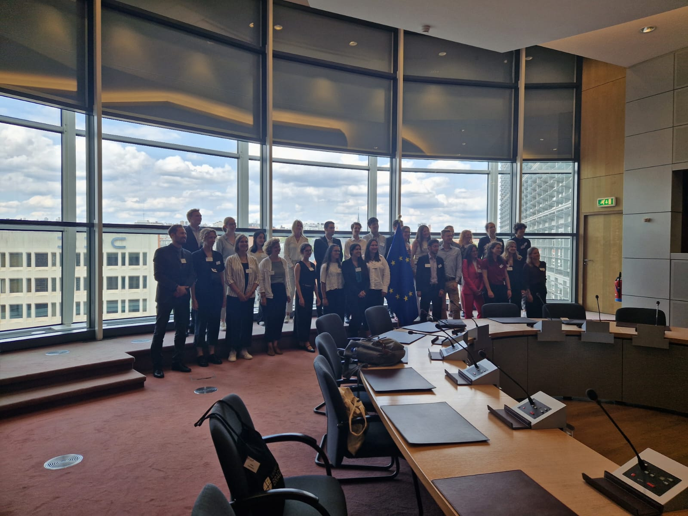
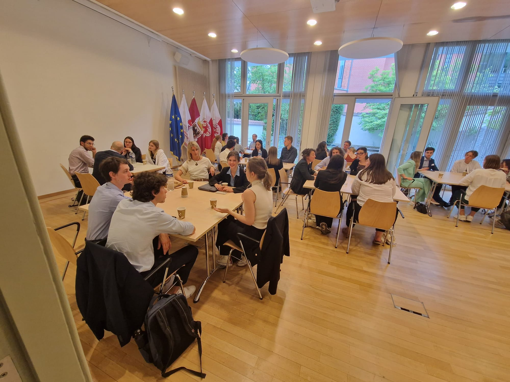
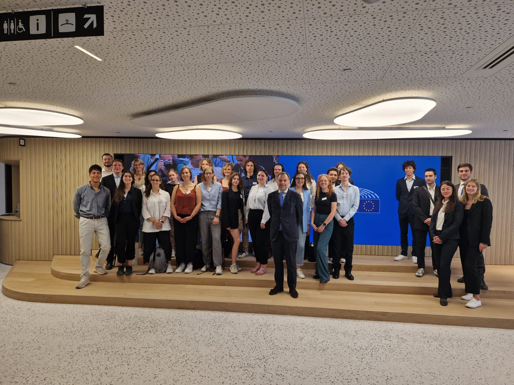
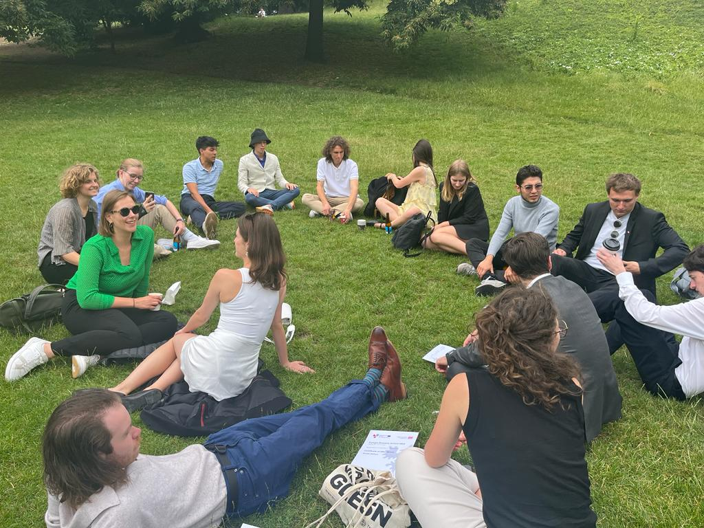
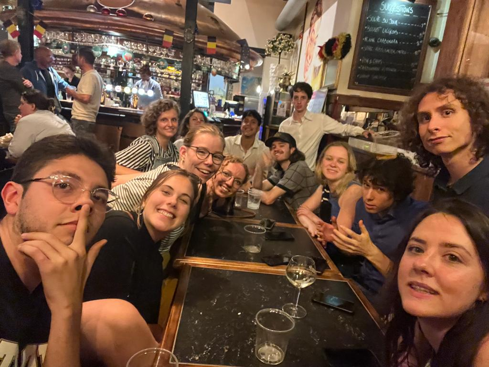

# Part 1 - the plane

I am writing from the plane. I am in the first row in the middle. I feel I am very lucky. My week of lectures has ended this morning with a discussion on the migration problem in the EU. It was something I have never experienced because we had to take the side of the politicians that don’t accept or better want to protect the EU from immigration. Usually this is the opposite to what I think and it was good for me to push myself out of the bubble and try to see everything from a new prospective. I can’t lie that it was difficult to be in the shoes of people that uses hate and aversion towards the different and the unknown to get votes and get things done, because this is what it does boil down to.

During this experience I really felt what it is to be on the other side and even more I realize how much I tend to be a “super-part” everyday life. Here is where the inception happens. Through meditation I learned to be equanimous and be balanced on most topics. Then reading the book “reality transurfing” in the past weeks I learned how wise and useful it is not to take any side in discussion or idealisms. And in the end this week I experienced the importance of taking a side and trying to be on the side of the right. And here I also see both the arguments to take a position and not to take a position. I am equanimous. According to the meditation we should always have in mind to reduce suffering and that’s what I have in mind for the future and I would always like to deploy all my resources towards this goal.
As a concluding anecdote, I wanted to share my experience with homeless people I met in Bruxelles, because yes where the most money are the most poverty is as well.

This homeless people where there on the streets and I wanted to do anything to help. Probably I didn’t. I could have shared a loaf of bread that in the end I had to throw away. I could have brought them some items I have bought from too good to go, but I felt it was wrong and I felt embarrassed, but most of all I didn’t know if that was the right way to act. In this regard I think there is no, or very little, actions that can be done at that very moment to solve something, but I am a big fun of compounded interest and doing small, or big, things over a long period of time in order to really solve a problem. 
This proved to be successful different times. Especially I realized this with my education: there was no single thing that I could have done different, because in the end they brought me at this point. Now I really want to focus only on a handful things, do them at a very high level and be able then to give value to many through my work and time. With this I want to say that we are in this together, we are all excellent at speaking or writing, but will we have the courage to act and really put our words into actions?

I hope so and I will bring this experience with me and use it as a tool for my next decisions to be aligned with the goal of giving the most and making this place a little better because of my presence. If I could help a single person than my goal will be fulfilled.

We are in a cloud now, there is some turbulence and I will have to close now.

# Part 2 - the train

I start to write the second and conclusive part here in the train. I was able to get a good train going to Pandora and I am still active and I feel I would like to write or relax.
I still don’t believe what happened on the plane. It is so strange, yet so beautiful. Some times I think is karma other I just understand that it is only a coincidence. Maybe it was just how the algorithms of Ryanair works in assigning random places. Actually it probably don’t assign random all places but it will prefer the ones that has no additional value first. Then maybe I was a bit late for the check in and they first because all the others were already taken (?). This is a big supposition but I am grateful that happen, and at the same time I now realized that I should be equanimous and don’t crave this feelings but rather really live to the fullest every day.

On this proposition I realized how better it is to really always try to live to the fullest. Life is short and it does not have any prefixed length. So living everyday in the present is the real life hack. And also memento more has become increasingly more important as if a person lives a life with a purpose and a direction whenever it will end it will be a good life. If someone might not have a purpose or direction that might be a bit more difficult.

Let me know what you think in this regard in the comments and I will leave you with a couple of photos of my and our class in  Bruxelles.

Ciao!

