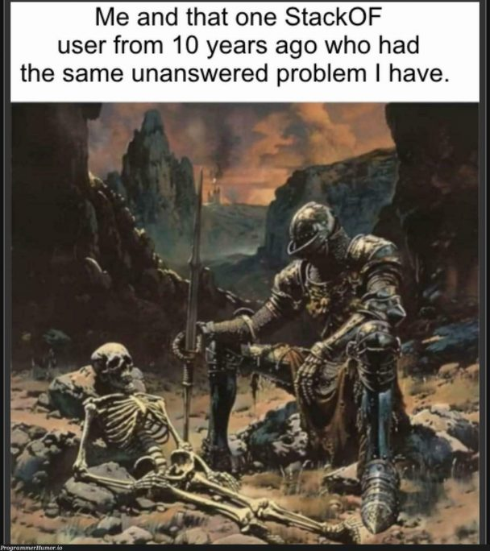

# COLMAP - a guide for optimal results

## Intro

So I spent the last 2 months trying out how to properly use and optimize COLMAP. Unfortunately most informations are buried in github issues, pull requests. You can get 70% from the official deocumentation, but most of the remaining I had to get it from trial and error and countless hors of searching trough GitHub trying to figure out if people had the same problem as I did.

I found out so far that there are 2 main methods to improve results and can be directly impact the reconstruction without complicated tweaks in the code.

1. Better input. (garbage in, garbage out)
2. Settings finetuning for reconstruction

I'll mainly talk about this two and maybe with some BONUS.



### Context

I am particularly interested in Large scale reconstructions from only images and visual clues. I think I chose the hardest path, but that is what I like. COLMAP has impressive results on small scale reconstruction, but when the number of images increase, and the kms that the reconstruction spans, there is where the real trubles are. For context I want to reconstruct around 1KM of my CAMPUS, and that has some challenges, plus the campus is very similar and many people lose themselves because of similarities, so I imagine why COLMAP has some shortcomings.


## Better Input

COLMAP relies on SIFT to extract features. During my countless tests, I found that to be quite reliable in standard settings, and using more sophisticated feature matchers, only increased complexity without a worthy reward. So I will stick to it.

What really mattered in the end, was to get the perfect time of the day and be able to capture with exactly the perfect lighting conditions. That improved the reconstruction drastically. Also I had to pick a time of the day where not many people are around because that will confuse the feature matching algorithm.

I ended up waking up at 6.30 AM and walk around with 2 gopros and an helmet to get the perfect results. A little bit later and the sun would create the flares that will mess up with the features and ruine all the process.

> **Fisrt advice:** choose the best light conditions you possibly can get

> **Second advice:** avoid crowds and moving objects to avoid heavy postprocessing and iterate on the ideas faster

Another thing that probably I casually discovered, is that if I walk a straight 
line in front of me, the reconstruction is going to be suboptimal. Instead if I zig-zag, through the path, the result tend to be more accurate. At first the motivation for such a behaviour was unknown, but after carefully reading and understand the limitation of structure-from-motion, it was clearer that the problem becomes ill posed when following a co-linear motion. 

> **Third advice:** have a "zig-zag" movement while you capture the environment to avoid reconstruction **imprecisions** or **failures**

I'll try to add more as I learn but for now this is it.

## Finetuning settings

I really had to fight hard for this one. I tried to use the more robust and **slower** method of more discriminative feature matching:

`--SiftExtraction.estimate_affine_shape=true and --SiftExtraction.domain_size_pooling=true. In addition, you should enable guided feature matching using: --SiftMatching.guided_matching=true.` from [here](https://colmap.github.io/faq.html#:~:text=%2D%2DSiftExtraction.estimate_affine_shape%3Dtrue%20and%20%2D%2DSiftExtraction.domain_size_pooling%3Dtrue.%20In%20addition%2C%20you%20should%20enable%20guided%20feature%20matching%20using%3A%20%2D%2DSiftMatching.guided_matching%3Dtrue.)

It works but on extreme cases and at an enormous price, as it doesn't even use the GPU. So I ended up sticking with the "Standard" procedure. I also only use sequential matching as videos benefits a lot from such processing strategy.

An average reconstuction is done as following:

1. Convert the video into a sequence of images
2. Run COLMAP 
3. Enjoy (60% of the times)

My goal is to improve the likelyhood of success.

### 1. Image processing

(Usually I deal with multiple cameras, that is why I heve the folder 00/ standing for the camera ID)

First I create a folder and then run the following command. You can choose the FPS, experimentally I saw that 3 is the best, sometimes 2 is also good if the movement pace is slow (e.g. human walk) otherwise you can try 4 if there are holes in the reconstruction or errors, most of the times that should fix. If it doesn't try 5 but most likely you need to go to the previous step and reiterate there. 
(always talking for human walking velocity, if using bike or car, that is a whole differnt story)

```bash
mkdir -p ./00/images
ffmpeg -hwaccel auto -i ./video/GX010041.MP4 -vf "fps=4,scale=iw:ih" -q:v 8 ./00/images/%06d.png
```

## 2. Run COLMAP 

After a lot of iteration the script I found to be the most succesfull is the following:

```bash
# RUN RECONSTRUCTION

cd 00

echo "Running Feature Extractor"
# colmap feature_extractor --database_path ../database.db --image_path ../images --SiftExtraction.estimate_affine_shape 1 --SiftExtraction.domain_size_pooling 1 
colmap feature_extractor --database_path ./database.db --image_path ./images --ImageReader.single_camera_per_folder 1 --ImageReader.default_focal_length_factor 0.5 --ImageReader.camera_model OPENCV

# # echo "Running feature matching..."
# colmap exhaustive_matcher --database_path ./database.db --SiftMatching.max_distance 1 --SiftMatching.guided_matching 1
colmap sequential_matcher --database_path ./database.db --SiftMatching.max_distance 1 --SiftMatching.guided_matching 1

# # echo "Reconstructing 3D model..."
colmap mapper --database_path ./database.db --image_path ./images --output_path ./

# # glomap mapper --database_path ./database.db --image_path ../image_0 --output_path ./glo

echo "Showing result"
colmap gui --import_path ./0 --database_path ./database.db --image_path ./images

# colmap gui --import_path ./geo-registered-model --database_path ./database.db --image_path ./images
```

You basically CD into your folder, find already images folder and run:
1. feature extraction -> standard 
2. sequential matcher -> faster but only matching images that are close in "time"
3. reconstruct the model
4. Show the model. Usually is saved to 0. but if not, check how many other folder are created 0,1,2 etc... based on how many reconstruction has been done.

Enjoy! now with a 90% chance of success!

Let me know if you have other questions, and in the future I might release some comparison between GLOMAP and COLMAP if you are interested.