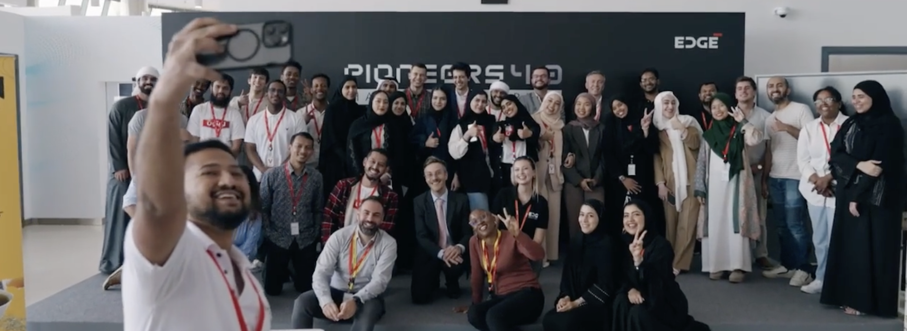
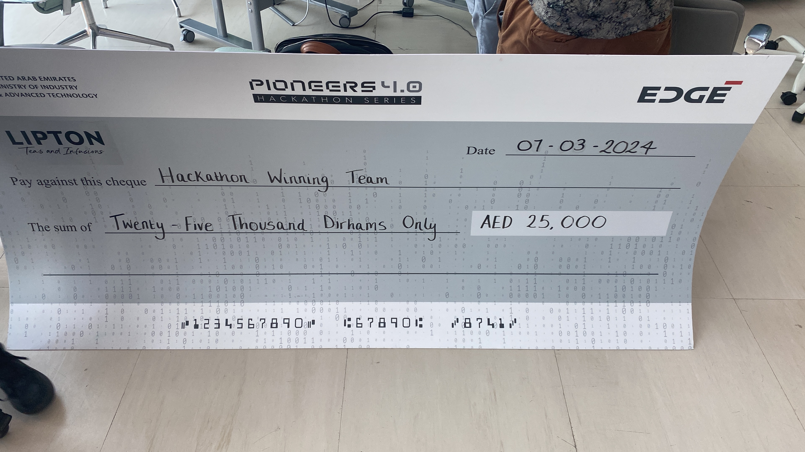
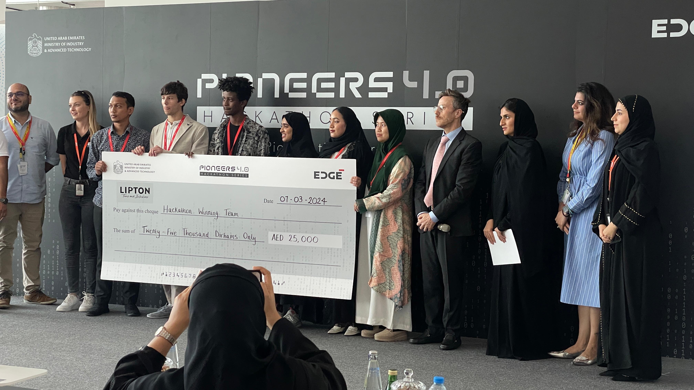

# My first Hackathon in the UAE

I had the opportunity to participate in the Pioneers4.0 Hackathon, organized by the Edge together with MoAT and partner LIPTON tea. It was a 72-hour event, where we had to develop an optimization solution to optimize the production and blending of tea.

I was part of a team of 5 people, and we were able to develop a solution that was able to optimize the production of tea, considering the different types of tea and the different blends that could be made. We used a simple rule-based algorithm to optimize the production and blending of tea, and we were able to present a working prototype at the end of the event.

It was a great experience, and I was able to learn a lot about the tea industry and the challenges that the industry faces. I also learned a lot about the different types of tea and the different blends that can be made. It was a great opportunity to work with a team of people from different backgrounds and to learn from each other.

We also managed to win the competition with a mix of team-work, creativity as well as technical skills. It was a great experience and I am looking forward to participating in more hackathons in the future.

Thanks to the Edge and MoAT for organizing the event, and to LIPTON tea as well. I am looking forward to be part of the LIPTON team in the future, with the internship that I was awarded at the end of the event.

Following some pictures of the event:

