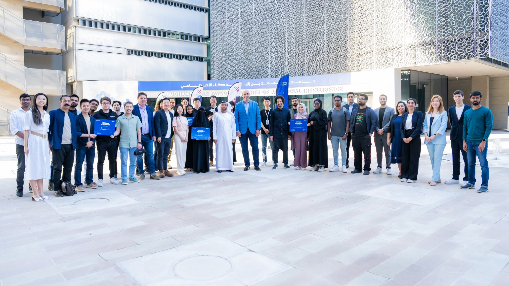
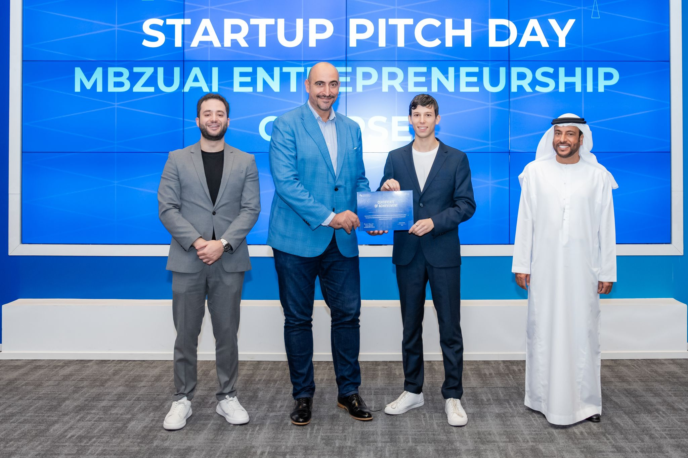
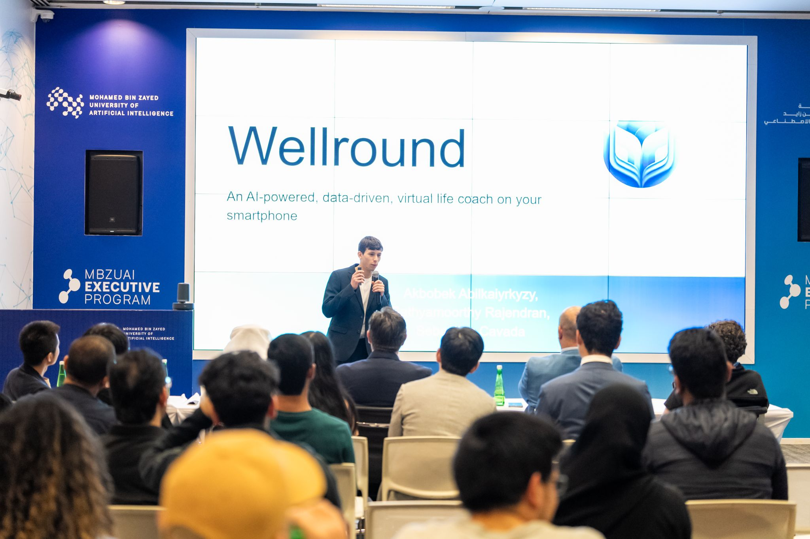
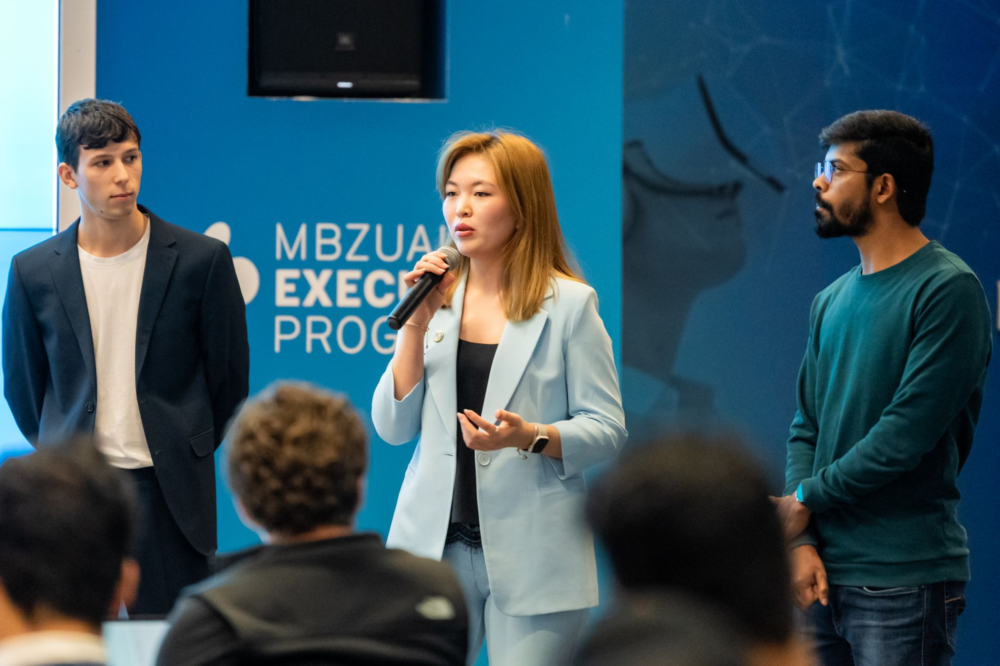

🚀 A Milestone at the Entrepreneurship Pitch Day 🌟

What an enriching experience for WellRound during last week's Pitch Day organized by MBZUAI (Mohamed bin Zayed University of Artificial Intelligence) and startAD as the conclusion of the MBZUAI Entrepreneurship Course. Our journey was packed with learning and invaluable insights!

The chance to present our AI-driven idea to the esteemed jury members Jean-Luc Scherer, Sultan Al Hajji, Selim Tira, Dr Ramzi BEN OUAGHREM and Michael Huang was both challenging and rewarding. Their feedback is a treasure trove, guiding our next steps.

Kudos to everyone at StartAD for the great opportunity, in particular, a huge thanks to Flo Akinbiyi, Adnan Dekedek, and Jenny Li for their enthusiasm and expert guidance!

A big shoutout to the winners for their amazing pitches and ideas, and to everyone that participated!

My colleagues Akbobek Abilkaiyrkyzy, Sathya R, and I are already gearing up for our Wellround's next iteration, inspired and more focused than ever.

🔑 Key Takeaways:
- Embrace every piece of feedback for growth.
- Each pitch sharpens our vision and storytelling.
- Collaboration fuels innovation.

