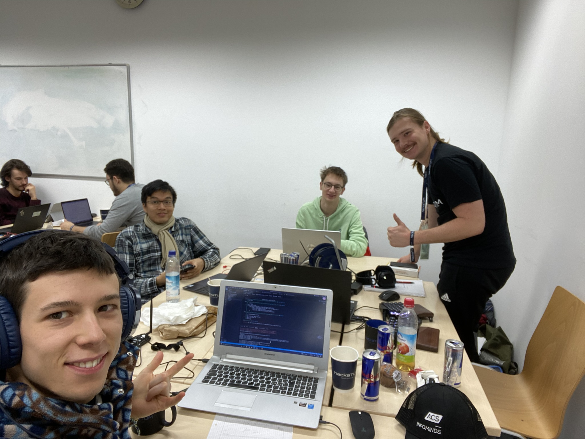

Pokemon Geo is our geo-tagging game built during HackaTUM 2022 (Huawei Challenge) based on OpenStreetMap (https://www.openstreetmap.org) and Mapillary (https://www.mapillary.com).

In the app, users interact with the real world by solving "issues". While taking a walk, players can take photos, tackle time-based challenges, compete on a leaderboard, and help improve OpenStreetMap tags.

We built our User Interface with Flutter, our backend with Flask and trained our photo classification model with PyTorch.

This hackathon was a useful exercise in quickly forming a team, choosing a challenge, and shipping a working prototype under time pressure. A short video recap is available in the links above.

Following are some of the photos:

