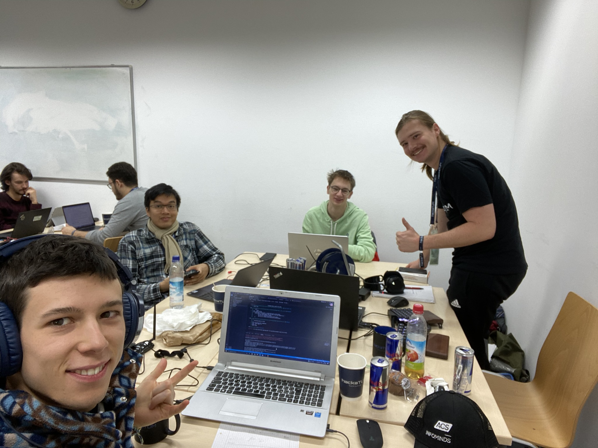

Pokemon Geo is our geo-tagging game built during HackaTUM 2022 (Huawei Challenge) based on OpenStreetMap (https://www.openstreetmap.org) and Mapillary (https://www.mapillary.com).

In our app, the user is interacting with the real world by solving "issues". While taking a walk, the player can take photos, tackle time-based challenges, compete in an online leaderboard and much more. At the same time, this helps OpenStreetMap improve their tags.

We built our User Interface with Flutter, our backend with Flask and trained our photo classification model with PyTorch.

We hope you have fun playing our game and we wish you a wonderful day!

Gotta catch ‘em issues.

This hackathon was a very fun one because I did not know anybody once I got there. I had to find a team and a challenge. I was really stressed and worried.
In the end it turned out great! I met a lot of people and I had a lot of fun, if you want to know more just check the VLOG on youtube.

Following are some of the photos:

