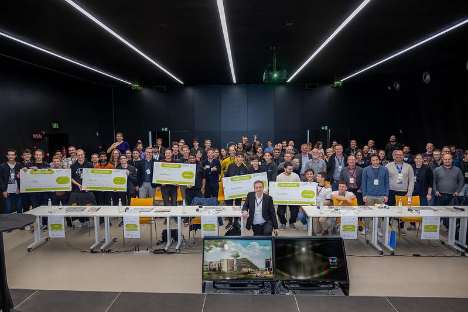
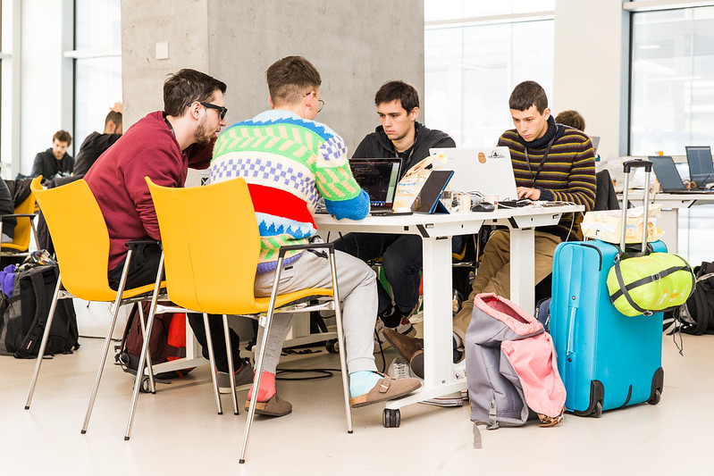
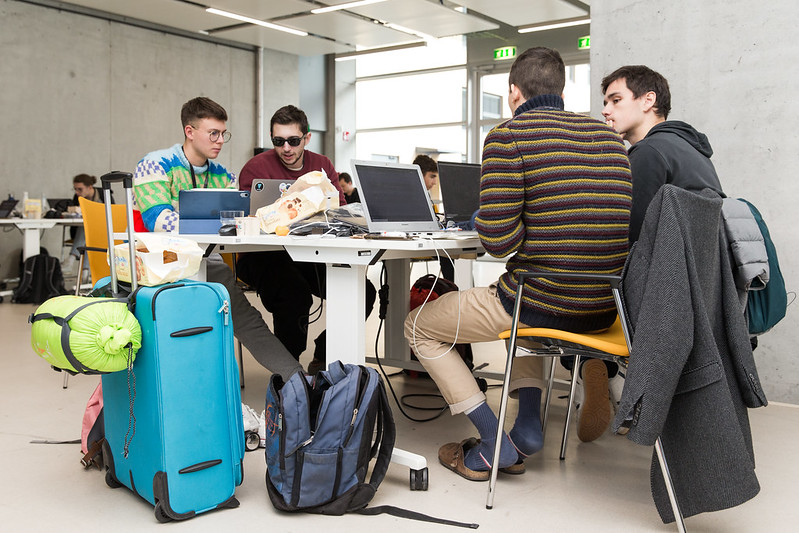

The aim of our team was to develop a fully autonomous logistic system for hotels and vacations house to manage their laundry as well as textile such as curtains, carpets, and so on. The system relies on Arduino, to automate and track the movement and the current position of the textile in the facility. 

An app will also enable the staff members to read and update any value related to the articles of clothing. 

A dashboard will also be available to the management in order to have accurate monitoring of the situation as well as giving advice of the best and most efficient actions to be taken.

There we are:

 