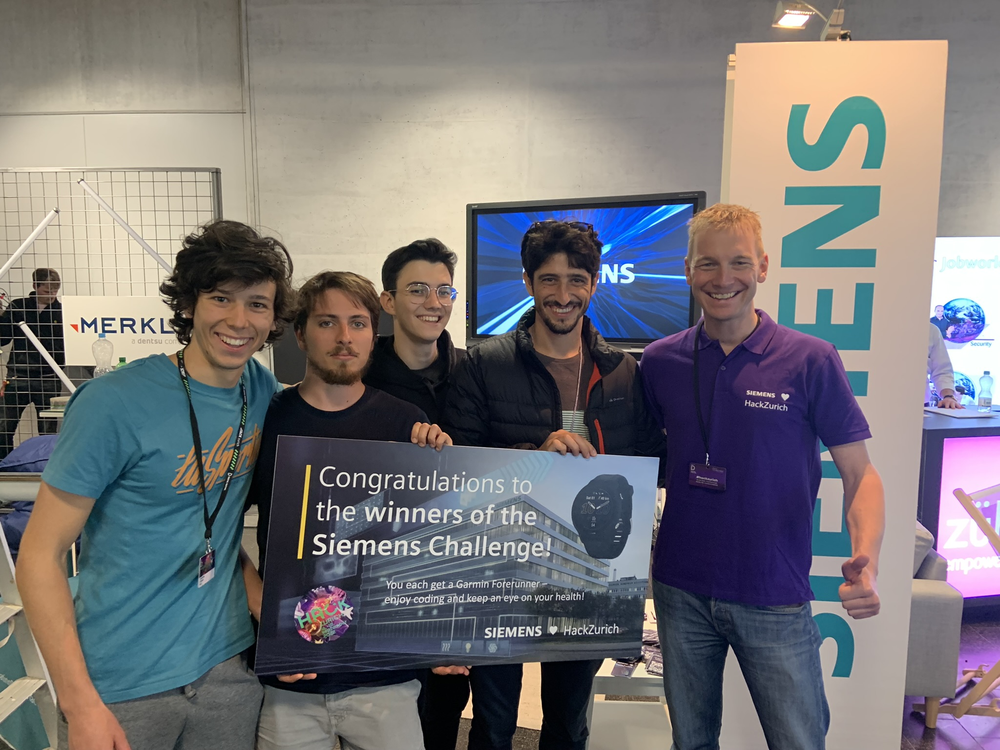
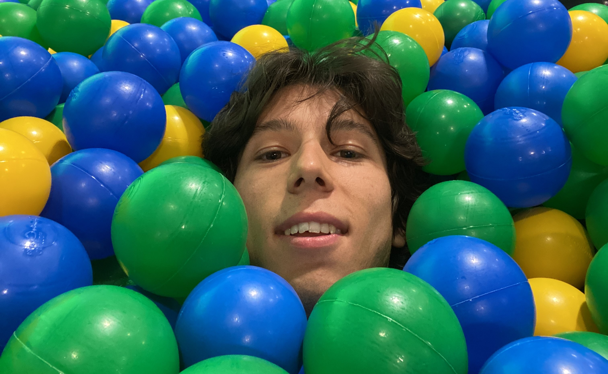

Out of the Blue is a versatile tool that allows anyone to obtain a detailed 4D model based on a 2D blueprint, unlocking a set of new services that vary from creating a perfect digital twin of the house (that supports smart automated routines to reduce risks) to an optimized instrument for crisis containment which could be a keystone tool into the daily work of firefighters.

HackZurich is Europe's largest hackathon. I joined without a pre-formed team, collaborated with participants I met during the event, and contributed to a winning project under tight time constraints. A short video recap is available in the links above.

Following are some of the photos:

