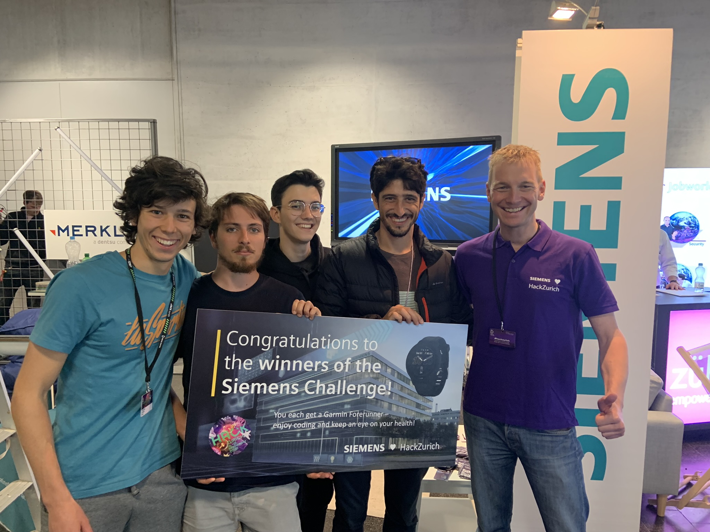
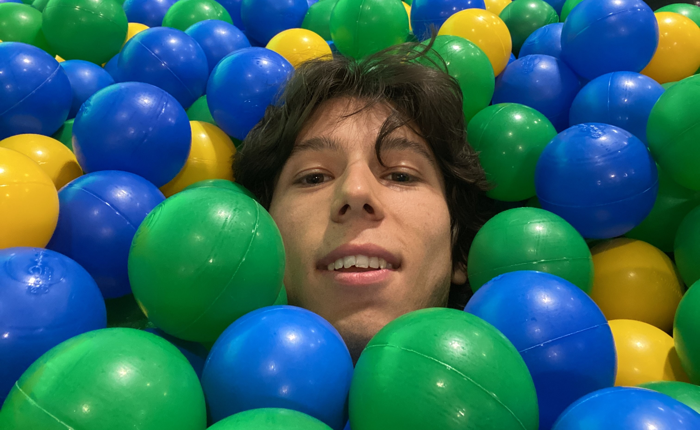

Out of the Blue is a versatile tool that allows anyone to obtain a detailed 4D model based on a 2D blueprint, unlocking a set of new services that vary from creating a perfect digital twin of the house (that supports smart automated routines to reduce risks) to an optimized instrument for crisis containment which could be a keystone tool into the daily work of firefighters.

HackZurich is the biggest hackathon in Europe. It was a priviledge for me to be selected among the participants. Again I knew nobody, but in the end I met some old friends from other hackathons, we teamed up, we won and most importantly we had so much fun. Check out the VLOG on youtube.

Following are some of the photos:

