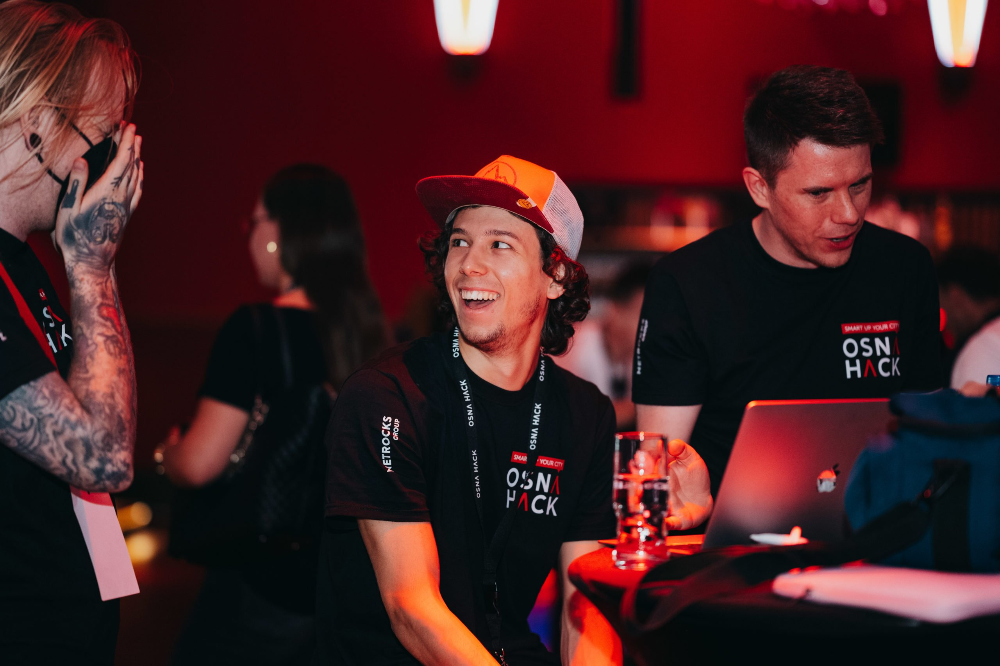
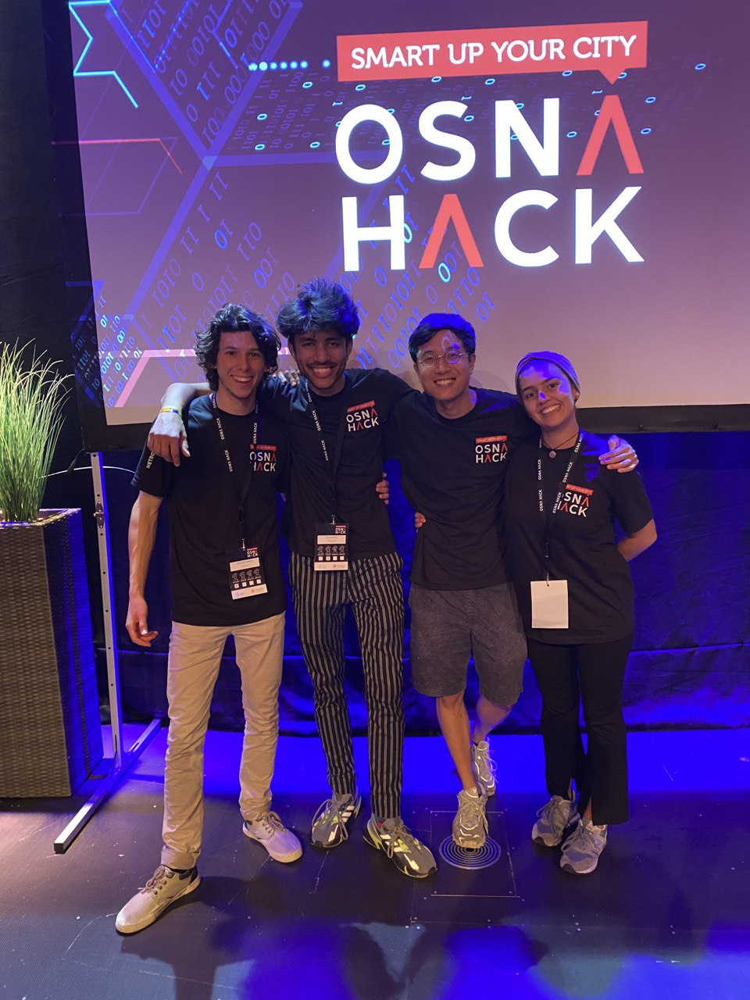

While I was in Erasmus I had the pleasure to work with brilliant people, Sing, Pravir and Giulia, in an hackathon in the city I was doing my Erasmus in. It was a great experience when I think back. We didn't win or anything, but we had so much fun and I personally learned a lot afterwards, overanalysing the experience and how it
turned out.

This is what has been wrote about our project:


Bagel sorgt dafür, dass Radfahrer sicher und effizient in Osnabrück unterwegs sind. Das wird durch die Daten von Google Maps, GPS und Ampelplänen auf der App möglich. Indem unsere Stadt fahrradfreundlicher wird, werden die Osnabrücker dazu ermutigt, ein saubereres, friedlicheres und nachhaltigeres Zuhause zu schaffen.


In english also:


Bagel ensures that cyclists can travel safely and efficiently in Osnabrück. This is made possible by data from Google Maps, GPS and traffic light plans on the app. By making our city more bike-friendly, Osnabrückers are encouraged to create a cleaner, more peaceful and sustainable home.


There we are:

The video of all the presentations, our presentation can be found at minute 55.

