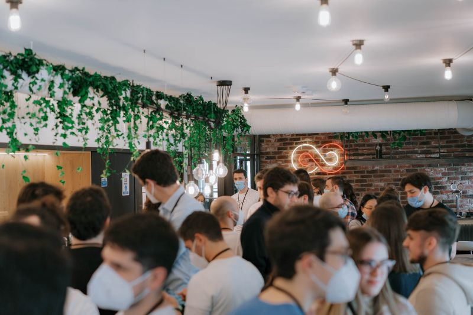
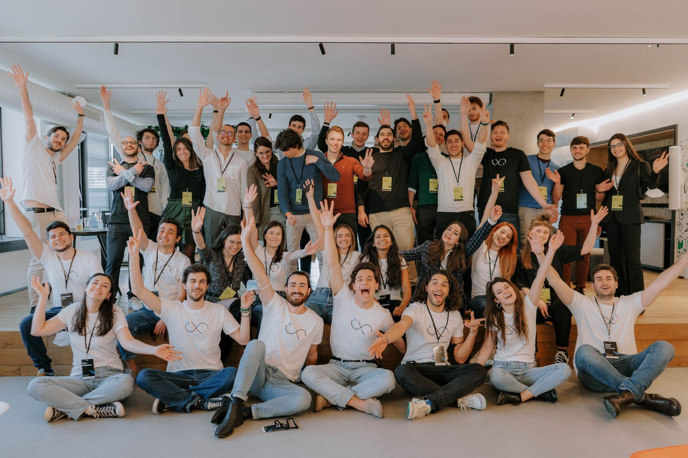
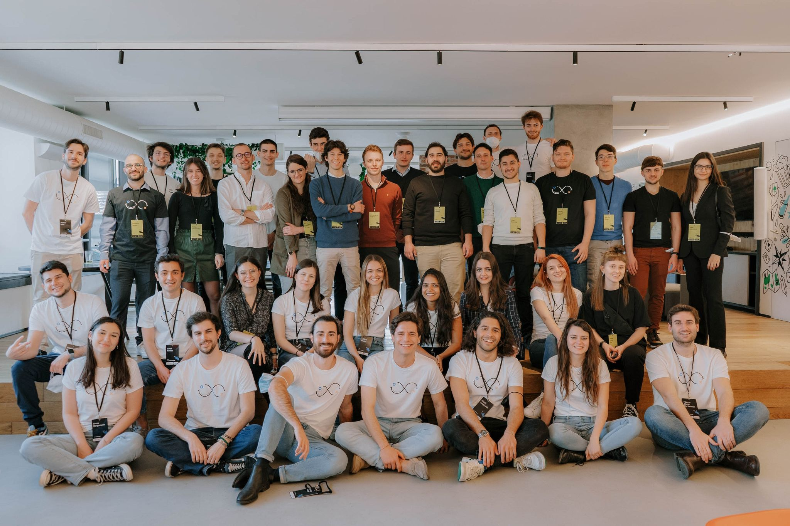

I presented this idea on a topic very near to me. That is mental health. It was the occasion in which I really get near to it. 

It was the opportunity to learn about a new thing. Produce what I always liked, ideas. Startup-ideas.

I was selected among 40 finalist that have been invited to Milan, at the Bending spoons headquarters. It was an amazing experience.

I met some of the most brilliant mind I've ever met. I had the honour and luck to be able to talk to the 3 winners even before they were announced. As if I had a 
6th sense of where greatness can be found. Jokes apart it was one of the best experiences of growth, emotions and learning in a couple of year.

In the photo you can see me casually at the centre, usually I am not there but this time I felt at home. With like-minded people. One of the best feelings in the world.

There we are:

 

