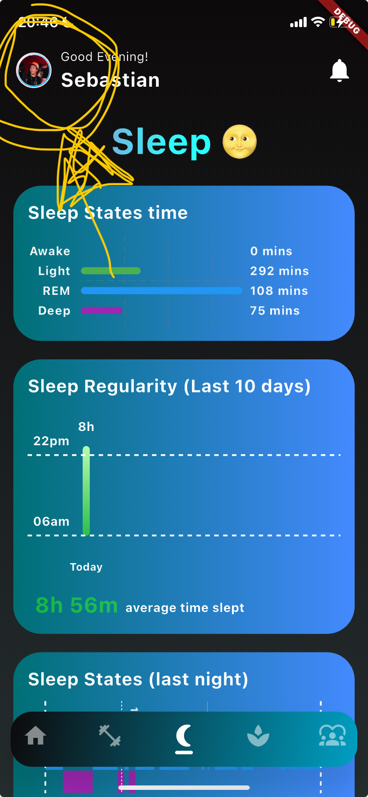
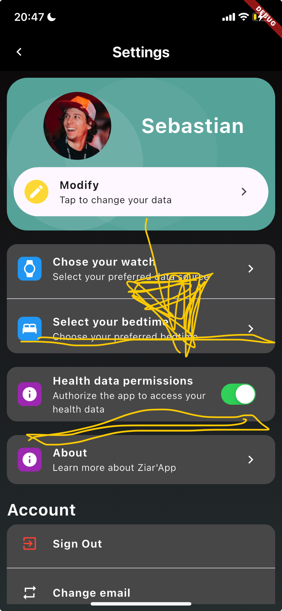
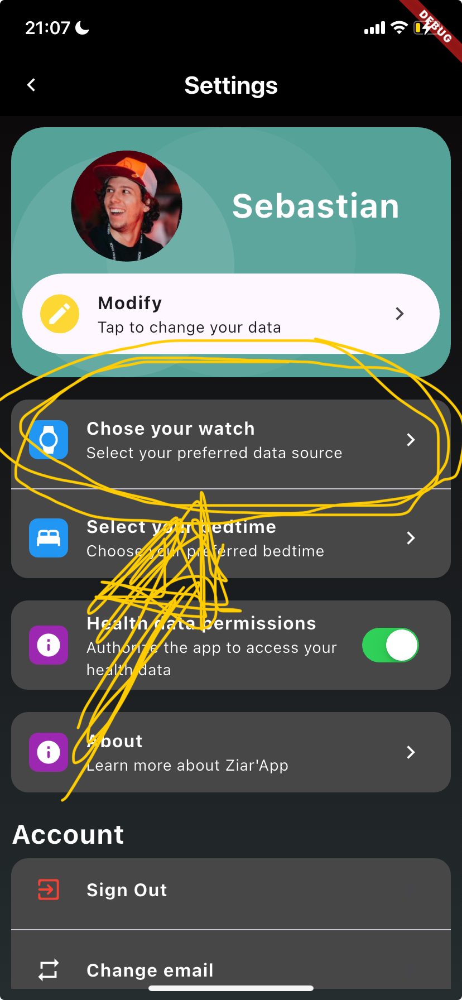
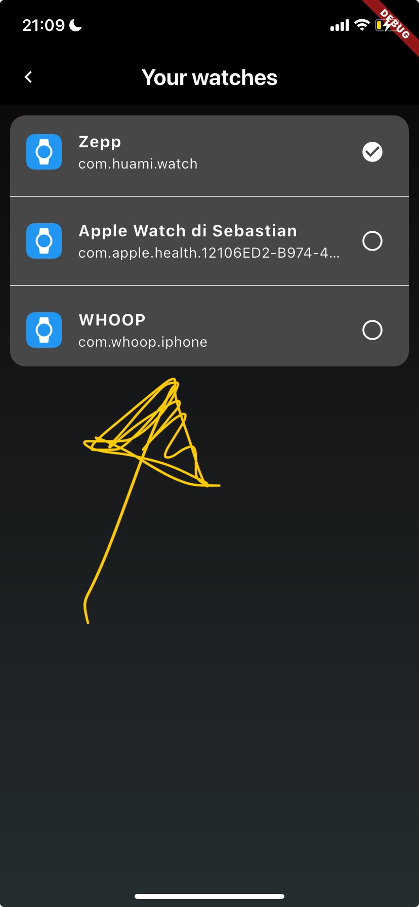

# Wellround - How to use it

This is the guide for the full alpha version of Wellround.

If you are here and wanted to be involved in the closed alpha version of wellround email me at [sebastian.cavada@mbzuai.ac.ae](mailto:sebastian. cavada@mbzuai.ac.ae) 

The supported smartwatches are:
- Apple Watch
- Amazfit
- Garmin (?)

Also it is fully supported on iOS. Android coming soon.

If you want to know more about the app, please visit the (SOON AVAILABLE) webpage.

## Ok now the interesting part

I know is not very intuitive, but hey this is the alpha version.

- Install the app, through TestFlight.

- Allow the app to access your health data

- Boom you can now see your data in the app.

## Allow the app to access your health data

### Step 1: go to settings

### Step 2: locate the toggle for health data

### Step 3: Allow the app to access your health data

A pop up will appear, click allow to EVERYTHING.

Your date are now our data.

Just joking of course, our priority is to preserve your privacy.
If you don't trust us, check out our open source code on GitHub.

### Step 4: Select the device you want to connect

Just click on that setting

### Step 5: Select the device you want to connect

Select one and only one!

## Boom you can now see your data in the app