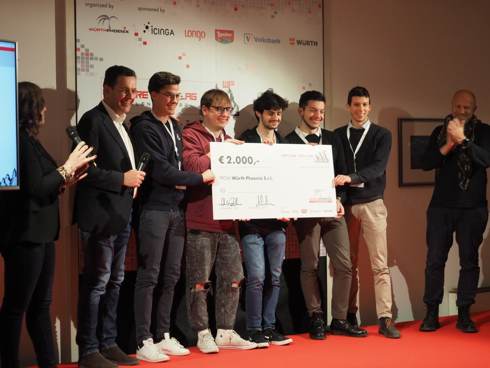

# Wurth 2022

This was a cyber-security challenge, in particular a capture the flag. I was lucky to get accepted in a team where a friend of mine was, since I my team-mate was sick
that day. I ended up in a team of super cool guys as well as very smart and experienced people. I learned a lot from them and I hope I was able to help them as well.

The challenges were 5 and after arriving 1 hour late, we were able to solve them all before every other team and with nearly half an hour of spare time. We were the first team to finish the challenge. 

I learned a lot and I was also able to give my small contribution, but without the team I would have never been able to do it.

There we are:

