The following tutorial and notebook is about:

1. Implementation of **LoG blob detection algorithm** to detect flowers in the given flowers.png picture. This part also includes comparison between the method implemented from scratch and the one provided by OpenCV library.
2. Implementation of LoG with **normalized scale variations**. [A multiscale Laplacian of Gaussian(LoG) filtering approach to pulmonary nodule detection from
whole-lung CT scans](https://arxiv.org/pdf/1907.08328.pdf)
3. Performance of additional experiments with different **threshold values** for both algorithms.


## Implementation of unnormalized Laplacian of Gaussian filter for blob detection
**The idea:** Convolve an image with multiple different-scale "blob" filters and look for the zero-crossings in order to find edges in the specific scale space.

Laplacian is a second-order derivative scale invariant filter. Unlike first-order filters, Laplacian detects the edges at zero crossings i.e. where the value changes from negative to positive and vice-versa. To reduce the noise effect, image is first smoothed with a Gaussian filter and then we find the zero crossings using Laplacian. This two-step process is called the Laplacian of Gaussian (LoG) operation. 

$$
LoG(x,y) = -\frac{1}{\pi \sigma^4} \left [1 - \frac{x^2 + y^2}{2 \sigma^2} \right] \exp^{- \frac{x^2 + y^2}{2 \sigma^2}}
$$


```python
#!pip install scikit-image
```

To have an idea about what kind of output we should expect from implemented algorith we decided to firs run the LoG function available in the scikit-image library.


```python
import numpy as np
import matplotlib.pyplot as plt
from skimage import io, color, feature
import scipy

```


```python
def draw_circles(img, blobs, cmap='CMRmap'):
    # this is the basic function that will be used to draw detected blobs 
    
    fig, ax = plt.subplots(1, 1, figsize=(10, 10))
    ax.imshow(img, cmap=cmap)
    for blob in blobs:
        y, x, radius = blob
        c = plt.Circle((x, y), radius*np.sqrt(2), color='white', linewidth=2, fill=False)
        ax.add_patch(c)

    plt.show()    
```


```python
# drawing multiple outputs in one graph
def draw_circles_multi(img, coordinates, cmap='CMRmap', titles = []):

    fig, ax = plt.subplots(1, len(coordinates), figsize=(20, 20))
    
    for i, coordinate in enumerate(coordinates):        
        ax[i].imshow(img, cmap=cmap)
        for blob in coordinate:
            y, x, radius = blob
            c = plt.Circle((x, y), radius*np.sqrt(2), color='white', linewidth=1, fill=False)
            ax[i].add_patch(c)
            try:
                ax[i].set_title(titles[i])
            except:
                pass

    plt.show()    
```


```python
def draw_circles_multi_images(img, coordinates, cmap='CMRmap', titles = []):

    fig, ax = plt.subplots(1, len(coordinates), figsize=(20, 20))
    
    for i, coordinate in enumerate(coordinates):        
        ax[i].imshow(img[i], cmap=cmap)
        for blob in coordinate:
            y, x, r = blob
            c = plt.Circle((x, y), r*np.sqrt(2), color='red', linewidth=1, fill=False)
            ax[i].add_patch(c)
            try:
                ax[i].set_title(titles[i])
            except:
                pass

    plt.show()    
```


```python
# Read image
img = io.imread('../images/flowers.png')

# Convert to grayscale due to the fact that this algorithm is oriented onto having 1 parameter that would correspond to color (either pixel intensity or hue intencity)
img_gray = color.rgb2gray(img)

#io.imshow(img_gray)
res_skimage = feature.blob_log(img_gray, min_sigma=1, max_sigma=9, num_sigma=50, threshold=.1, overlap=.5, log_scale=False, exclude_border=False)

# Draw the results
draw_circles(img, res_skimage)
```


    
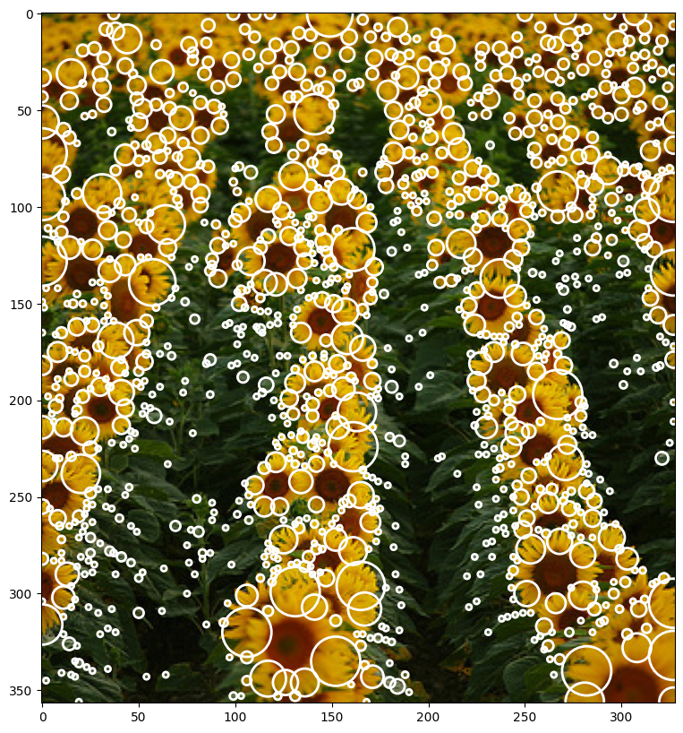
    


This image will be our starting point. It can be noted that light blobs on dark background were detected. What our experimentation will focus instead is on a slightly different approch. Our algorithm should detect dark blobs on light background.


```python
# definitions of second derivate Gaussian and Laplacians

def gaussian_2d(x, y, A=1, x0=0, y0=0, sigma=1):
    return A * np.exp(-( (x - x0)**2 / (2 * sigma**2) + (y - y0)**2 / (2 * sigma**2)))

def laplacian_2d(sigma=1):
    
    n = np.ceil(sigma*6)
    y,x = np.ogrid[-n//2:n//2+1,-n//2:n//2+1]

    return -(1/(np.pi*sigma**4)) * (1- ((x**2 + y**2) / (2*sigma**2))) * np.exp(-(x**2+y**2)/(2*sigma**2))

```


```python
def log_image(img_gray, n_kernels=9, threshold=0.2):

    """
    :param img: input image HAS TO BE GRAYSCALE (or single channel)    
    :param min_sigma: minimum sigma value
    :param max_sigma: maximum sigma value
    :param steps: number of steps
    :return: log image        
    """

    k = np.sqrt(2)
    sigma = 1

    kernels = []
    log_images = []
    sigma_list = []    

    # threshold the log images
    log_images_thresholded = []

    for i in range(0,n_kernels):
        sigma_curr = sigma * k**i
        sigma_list.append(sigma_curr)
            
        kernel_log = laplacian_2d(sigma=sigma_curr)
        kernels.append(kernel_log)

        log_image = scipy.signal.convolve2d(img_gray, kernel_log, mode='same', boundary='symm')
        log_images.append(log_image)

        log_image_thresholded = np.zeros_like(log_images[i])
        log_image_thresholded[log_images[i] >= max(log_images[i].flatten())-(threshold * max(log_images[i].flatten()))] = 1
        log_images_thresholded.append(log_image_thresholded)
    
    log_images_np = np.array(log_images)

    return log_images_np, kernels, np.array(log_images_thresholded), sigma_list
```


```python
def print_steps(log_images_np, kernels, log_images_thresholded, sigma_list):

    n_kernels = np.shape(log_images_np)[0]

    # plot the kernels
    fig, axs = plt.subplots(1, n_kernels, figsize=(20, 20))
    for i in range(n_kernels):
        axs[i].imshow(kernels[i], cmap='gray')        
        axs[i].set_title('kernel σ {:.5f}'.format(sigma_list[i]))

    # plot the log images
    fig, axs = plt.subplots(1, n_kernels, figsize=(20, 20))
    for i in range(n_kernels):
        axs[i].imshow(log_images_np[i], cmap='gray')
        #axs[i].set_title('σ {:.2f} max{:.2f} min{:.2f}'.format(sigma_list[i], max(log_images_np[i].flatten()), min(log_images_np[i].flatten())))
        axs[i].set_title('kernel σ {:.5f}'.format(sigma_list[i]))

    if (log_images_thresholded is not None):
        fig, axs = plt.subplots(1, n_kernels, figsize=(20, 20))
        for i in range(np.shape(log_images_np)[0]):        
            axs[i].imshow(log_images_thresholded[i], cmap='gray')
            #axs[i].set_title('σ {:.2f} max{:.2f} min{:.2f}'.format(sigma_list[i],  max(log_images_thresholded.flatten()), min(log_images_thresholded.flatten())))
            axs[i].set_title('kernel σ {:.5f}'.format(sigma_list[i]))

        fig, axs = plt.subplots(1, np.shape(log_images_thresholded)[0], figsize=(20, 20))
        for i in range(np.shape(log_images_thresholded)[0]):
            img_test = img.copy()
            img_test[log_images_thresholded[i] == 1] = 255
            axs[i].imshow(img_test)
            #axs[i].set_title('σ {:.2f} max{:.2f} min{:.2f}'.format(sigma_list[i],  max(log_images_thresholded.flatten()), min(log_images_thresholded.flatten())))
            axs[i].set_title('kernel σ {:.5f}'.format(sigma_list[i]))

    plt.show()


```

Here you can see all of the steps that are being taken in order to further detect the "blobs". First row displays the impact of each sigma value on the kernel and its values - those are kernels used for convolution. Second row shows the imact of the convolution operation on the original image with regard to sigma. Last line shows how thresholding  impacts the number of blobs that are "activated" after LoG filter. More on that in the last part of this task.


```python
log_images_np, kernels, log_images_thresholded, sigma_list = log_image(img_gray, 8, threshold=0.4)

print_steps(log_images_np, kernels, log_images_thresholded, sigma_list)
```


    
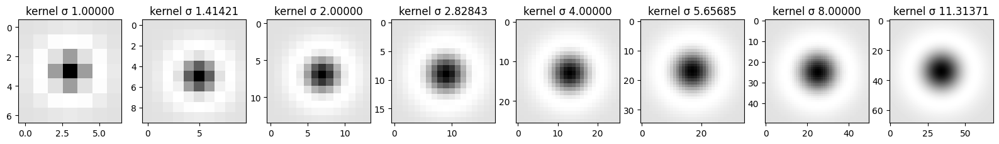
    


    
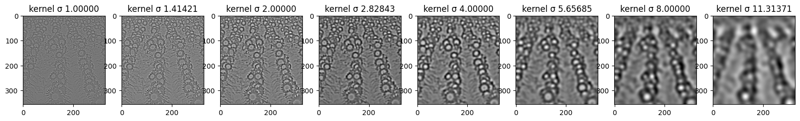
    


    
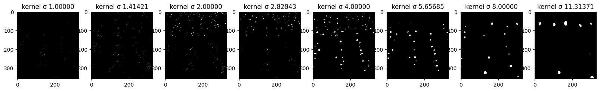
    


    
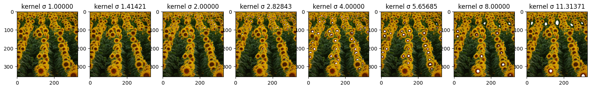
    


Here it is an example of how the circles or blobs are chosen. First we divide the image into chunks, with different size according to the sigma value. Then for every chunck, a maximum point is selected and it becomes the center of the blob for that particular value of sigma. We highlighted the patches where there is maximum activation in the image for the sigma of value 8. It is noticeable even if a bit hard to see the different shades of white and gray. The most white part is in the middle of the blob usually and it is the exact point chose as the center of the circle.

Also in order to achieve maximum accuracy we needed to pad the image to divide the image without any pixel being left out. We can do that and we pad with the black color as it doesn't affect the choice of the maximum point in the blob.
Without this small tweaking, some blobs near the edge vere left out.


```python
size = 45
padd_x = img.shape[0]%size
padd_y = img.shape[1]%size

index = 7

log_image_np = log_images_np[index].copy()

# convert log image to rgb
log_image_np = (log_image_np - min(log_image_np.flatten()))
log_image_np_1 = (log_image_np / max(log_image_np.flatten()))

log_image_rgb = color.gray2rgb(log_image_np_1)

img_padded = np.pad(img, ((0,padd_y),(0,padd_x),(0,0)), 'constant', constant_values=0)
log_image_thresholded_padded = np.pad(log_images_thresholded, ((0,0),(0,padd_y),(0,padd_x)), 'constant', constant_values=0)
log_image_rgb = np.pad(log_image_rgb, ((0,padd_y),(0,padd_x), (0,0)), 'constant', constant_values=0)
log_image_rgb = log_image_rgb * 255

threshold = 200

fig, axs = plt.subplots(len(img_padded)//size, len(img_padded)//size, figsize=(10, 10))

for i in range(len(img_padded)//size):
    for j in range(len(img_padded)//size):
        img_test = img_padded.copy()
        img_test[log_image_rgb > threshold] = log_image_rgb[log_image_rgb > threshold]
        axs[i,j].imshow(img_test[i*size:(i+1)*size,j*size:(j+1)*size,:])
        axs[i,j].set_xticks([])
        axs[i,j].set_yticks([])

    
```


    
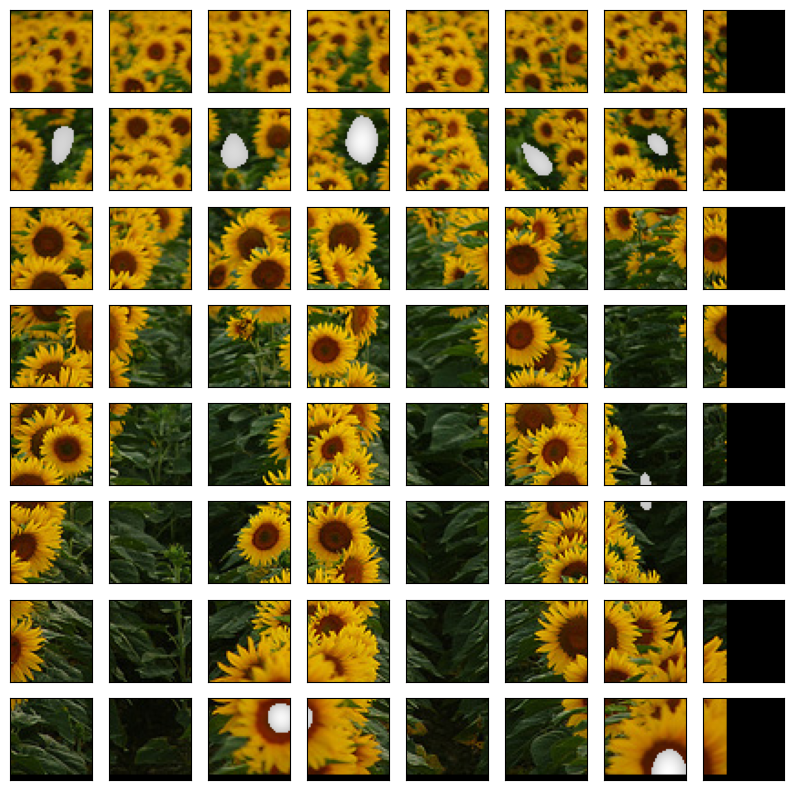
    


```python
def detect_blob_v2(log_images_np, k = np.sqrt(2), sigma = 1, percentage_high = 0.5):
    co_ordinates = []    

    co_ordinates = [[] for i in range(log_images_np.shape[0])]        

    for z in range(log_images_np.shape[0]):

        size = int(np.ceil(sigma * k**z)) * 5        

        padd_y = img.shape[0]%size
        padd_x = img.shape[1]%size        

        log_images_np_padded = np.pad(log_images_np[z], ((0,padd_x),(0,padd_y)), constant_values=0)                

        (h,w) = log_images_np_padded.shape                          
        
        threshold = max(log_images_np[z].flatten())-(percentage_high * max(log_images_np[z].flatten()))

        for i in range(int(size//2),int(h-size//2), size):
            for j in range(int(size//2), int(w-size//2), size):                
                
                slice_img = log_images_np[z,i-size//2:i+size//2,j-size//2:j+size//2]                                
                x_max, y_max = np.unravel_index(np.argmax(slice_img), slice_img.shape)
                
                if slice_img[x_max, y_max] > threshold:
                    co_ordinates[z].append((i+x_max-size//2,j+y_max-size//2,(k**z)*sigma))                         

    return co_ordinates
```

Here we are printing all the circles found for every sigma values. The smaller the sigma, the smaller the blobs that were found in the image.


```python
coordinates = detect_blob_v2(log_images_np)

titles = ["sigma {:.2f}".format(x) for x in sigma_list]

draw_circles_multi(img, coordinates, titles=titles)
```


    
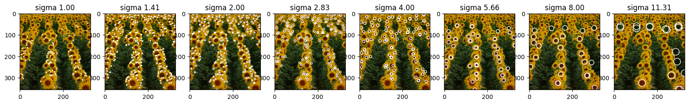
    


```python
def flatten_array_coordinates(coordinates):
    return [item for scale in coordinates for item in scale]
```


```python
coordinates_1d = flatten_array_coordinates(coordinates)
draw_circles(img, coordinates_1d)
```


    
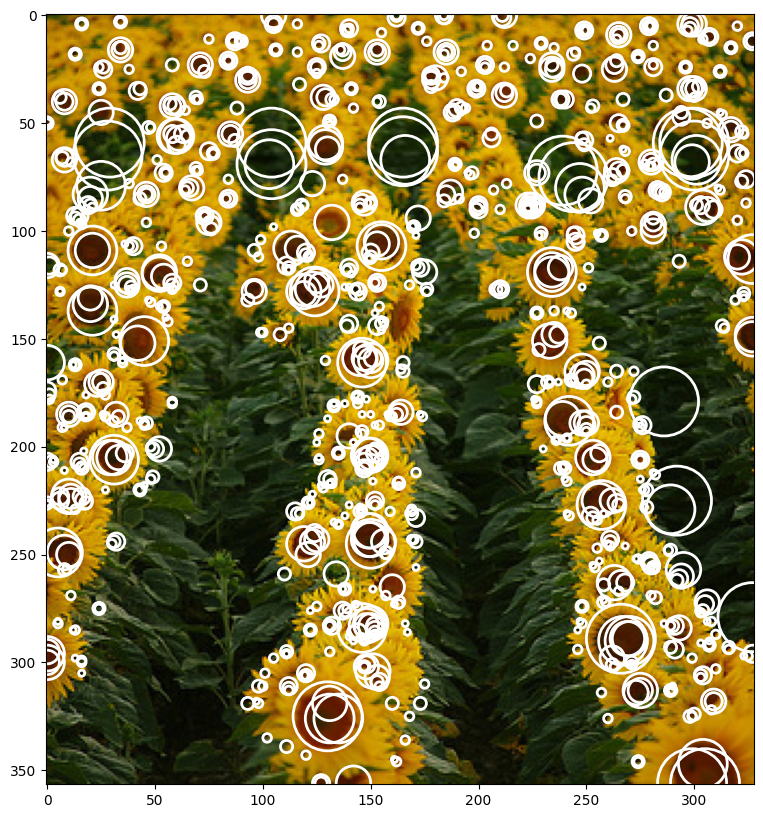
    


We implemented a very simple non-maximum-suppression, which is accurate and at the same time very fast. The idea is that we start from the bigger blobs and we give more importance to them. If smaller blobs are found inside the bigger blobs, they are eliminated from the blobs list. If the blobs are too close, less than the square root of the square of the radius of the two circles than the second one is also eliminated. The list is shrinked dynamically so that the computational cost is always less than O(n^2). On an average case scenario where nearly half of the blobs are eliminated the computational cost is closer to O(n*logn)


```python
def non_max_suppression(coordinates, threshold = 1):    

    print("before", len(coordinates))

    curr_coordinates = coordinates[::-1]    

    tmp_lenght = len(curr_coordinates)

    i = 0

    while(i < tmp_lenght):
        j = i+1
        while j < tmp_lenght:            

            x1, y1, r1 = curr_coordinates[i]
            x2, y2, r2 = curr_coordinates[j]
            
            distance = np.sqrt((x1-x2)**2 + (y1-y2)**2)

            if distance < threshold * (r1+r2):
                curr_coordinates.pop(j)
                tmp_lenght -= 1
                j -= 1

            j += 1

        i += 1        

    print("after", len(curr_coordinates))

    return curr_coordinates[::-1]

```


```python
# performing non max suppression in order to minimize blob overlapping in the image
res = non_max_suppression(coordinates_1d)
```

    before 996
    after 395


```python
res_skimage = feature.blob_log(img_gray, min_sigma=1, max_sigma=8, num_sigma=50, threshold=.1, overlap=.5, log_scale=False, exclude_border=False)

draw_circles_multi(img, list([res, res_skimage]))
```


    
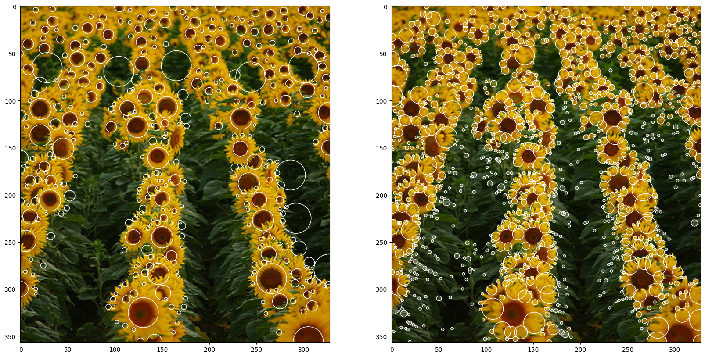
    


As we can see when comparing the algorithm from scratch (left) to the pre-build one from skimage (right), we can see that hand built algorithm actually has less outliers and targets the values that correspond to the flower centers, while the pre-build one has a lot more of small, let's say 'noisy' circles that don't contribute to the blobs, which gives the feeling that it targets highlights rather that the dark spots. As per the outliers in the from-scratch algorithm, they can be removed with the help of "normalization". We will talk about it in the next section.

### Test with light blobs

We also tested and compared our algorithm with the famous implementation on skimage. There are some difference. But overall we can say that it approximates it with high degree of accuracy. First of all the implementation identifies light blobs on dark background while our implementation works the opposite way. Therefore for a good comparation we had to invert our initial function and compare in this way.
We can see that they have many mor smaller point, than we have. That is due to the fact that they might have allowed more threshold in the first place. Secondly in their approach we can see less bigger circles or blobs. We are not sure about why, but a possible explanation is because they did normalize (again this far we haven't normalized the LoG yet) and also because of the non-maximum-suppression algorithm that they implemented which might be a bit more sophisticated.


```python
#res_skimage = feature.blob_log(img_gray, min_sigma=1, max_sigma=8, num_sigma=50, threshold=.1, overlap=.5, log_scale=False, exclude_border=False)

#draw_circles_multi(img, list([res, res_skimage]))
```

## Implementation of normalized Laplacian of Gaussian filter for blob detection
**The idea:** Increase effectiveness of the filtering of the original image with scale-normalized LoG kernels of continuously changing scale parameter.

Normalization is necessary to eliminate the effect of decreasing spatial derivatives with the increase of scale and is defined as the negated multiplication of LoG by σ2.

$$ 
L_{norm}(X, σ) 
$$ 
is the scale-space representation obtained for image I(X) by convolving it with normalized Gaussian kernel at continuous set of scales

$$
\nabla^2_{norm} L(X, \sigma) = \nabla^2_{norm} G(X, \sigma) * I(X)
$$

$$
\nabla^2_{norm} G(X, \sigma) = \sigma^2\nabla^2G(X, \sigma)
$$


```python
import cv2
```


```python
input_image = cv2.imread("../images/flowers.png")
image_rgb = cv2.cvtColor(input_image, cv2.COLOR_BGR2RGB)
image_gray = cv2.cvtColor(input_image, cv2.COLOR_BGR2GRAY)

# since given image is in .png format it was decided to use cv2 to read it, due to the fact that it
# removes 4th bin (alpha) that is taken into account if using skimage, for instance
# step with transforming image to rgb was made due to the fact that by default cv2 reads images in bgr - it was important to put colo channels back in place
# for LoG it is better to work with 1 parameter that would correspond to color (pixel intensity or color intensity), due to the fact that it explicitly works with intensity change and min-max response, that's why original image was converted into gray scale for experiments

f, (ax1, ax2) = plt.subplots(1, 2)
ax1.imshow(image_rgb)
ax1.set_title("Original image")
ax2.imshow(image_gray, cmap='gray')
ax2.set_title("Original image in grayscale")
plt.show()
```


    

    


```python
def create_normalized_log_kernel(sigma = 1.0):
    # Step 1: Creating normalized LoG filter/kernel template
    # calculating LoG kernel - mix of gaussian smoothing and laplacian second derivative to obtain kernel for convolving with the image in one step
    # main difference between this approach and the one without normalization is additional multiplier - np.square(sigma)
    # It  is necessary to eliminate the effect of decreasing spatial derivatives with the increase of scale (sigma)
    kernel_size = np.ceil(sigma * 6).astype(int)
    if kernel_size % 2 == 0:
        kernel_size += 1
    kernel = np.fromfunction(
        lambda x, y: (1 / (2 * np.pi * sigma ** 4)) *
                    np.array([
                     - (2.0 * sigma ** 2) + (x - (kernel_size//2)) ** 2 + (y - (kernel_size//2)) ** 2
                    ]) *
                    np.exp(-(((x - (kernel_size//2)) ** 2 + (y - (kernel_size//2)) ** 2)) / (2.0 * sigma ** 2)),
        (kernel_size, kernel_size)
    )
    return (kernel).squeeze()
    
```


```python
def convolve_image_with_log(image, conv_number = 6, sigma = 1.0, step_size = np.sqrt(2)):
    # Step 2: Performing convolution
    # to be able to capture blos of different sizes it is important to perform convolutions with multiple filters, because the value of maximum response will never reach its peak, until the diameter of blob perfectly matches the object of interest
    # for this reason it is important to try multiple kernels - to enhance blob detection
    # in this case to try to approach reasonable set of values I decided to go with 6 convolutions
    convolved_image = np.zeros_like(image)
    convolved_images = []
    # based on the selected reference paper I picked step size of np.sqrt(2) and update function for sigma - sigma_i+1 = sigma_i * k
    for i in range(0, conv_number):
        filter = create_normalized_log_kernel(sigma)
        # convolving image with generated kernel
        convolved_image = cv2.filter2D(image, -1, filter)
        convolved_image = np.square(convolved_image)
        convolved_images.append(convolved_image)
        sigma = step_size * sigma
    return np.array([i for i in convolved_images])
```


```python
# plot the log images
# plot the kernels
kernels, sigmas = [], []
sigma = 1.0
for i in range(7):
    kernel = create_normalized_log_kernel(sigma)
    kernels.append(kernel)
    sigmas.append(sigma)
    sigma = 1.27 * sigma

log_images = convolve_image_with_log(image_gray, conv_number=7)

print_steps(log_images, kernels, None, sigmas)
```


    
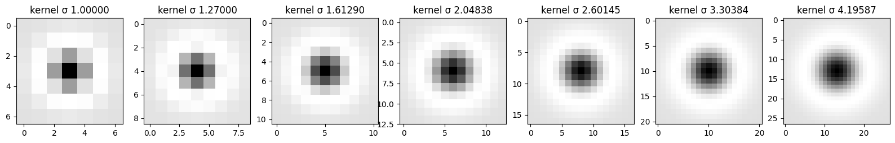
    


    
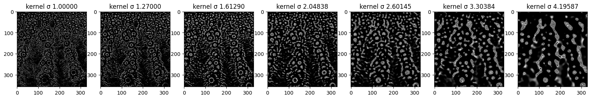
    


Here you can see how each sigma scaled kernel looks like and how it impacts the image. When comparing to the non-normalized kernel we can see that this kernel is indeed more sensitive to intensity change as it has activation in more areas than in previous example.


```python
def normalized_log_gray(image, sigma = 1.0, threshold = 0.03, conv_number = 6, step_size = np.sqrt(2)):
    image = image/255.0
    convolved_images = convolve_image_with_log(image, conv_number, sigma, step_size)
    
    # Step 3: Finding local maximas This step finds local maxima in N-dimensional (conv_number) search space with respect to both location and scale.
    height, width = image.shape
    # here we will be finding the coordinates of the local maximas with respect to pixel positions (h - height, w - width) and dimension (n - which is one of the responses of te convolved image)
    maximums = [] 
    for i in range(1, height):
        for j in range(1, width):
            tile = convolved_images[:, i-1 : i+2, j-1 : j+2] 
            maximum = np.amax(tile)
            # threshold is important because for each pixel there will be a maximum, but not all of the pixels them contribute to blobs
            if maximum >= threshold:
                # dimension will help with finding exact sigma that was used to define that kernel and blob sizes targeted
                dimension , x_coord, y_coordinate = np.unravel_index(tile.argmax(),tile.shape)
                # each point is (original coordinte x, original coordinate y, radius size)
                maximums.append((i+x_coord-1, j+y_coordinate-1, sigma * np.power(step_size, dimension))) #finding co-rdinates
    
    maximums = list(set(maximums))       
    
    return maximums

```

In this second part of the code we implemented a slightly different blob detection that finds the maximum across all the images convolved with different kernels. This is the main difference from the previous blob detection algorithm. This can be done now, because all the values have been normalized and therefore the maximum is consisten across all different activation function images. This way the image can be divided into many chunks of fixed sized and for each the maximum is found, then if it above the global threshold it is then considered a blob. In the end the same algorithm of non-maximum suprression has been applied.


```python
# calling the function with all default parameters before fine tuning the parameters and non-max supression
blobs = normalized_log_gray(image_gray)

# Step 4: Drawing blobs
draw_circles(image_rgb, blobs)
```


    
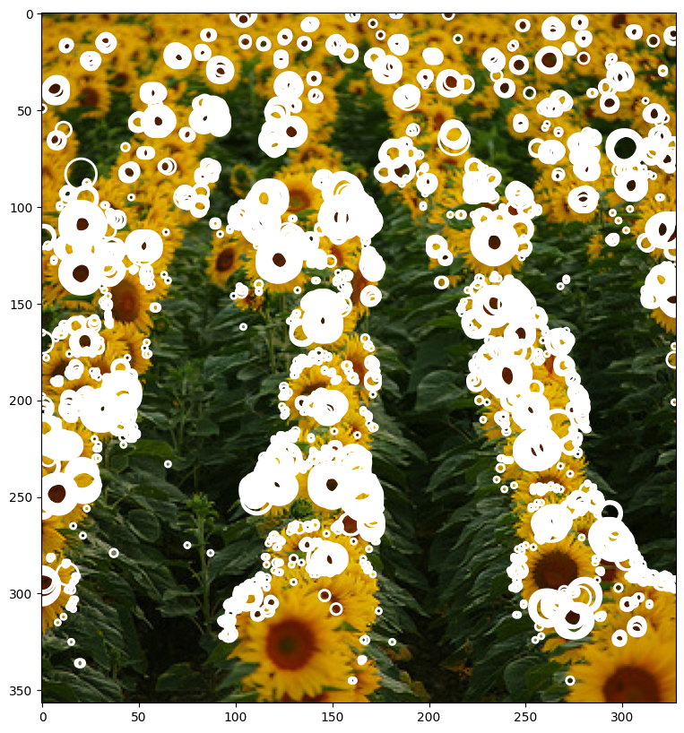
    


You can see a result of normalized LoG blob detection based on some "random" input hyperparameters. These are: step size, sigma, threshold and number of convolutions (these values were taken from multiple papers/lecture slides as "optimal"). In order to get a better detection we had to fine tune the parameters. Below you can see the results (including non-maximum suppression to reduce number of overlapping blobs).


```python
optimal_blobs = normalized_log_gray(image_gray, sigma=1.1, threshold=0.04, conv_number=8)
optimal_blobs = non_max_suppression(optimal_blobs)

draw_circles_multi(img, list([optimal_blobs, res, res_skimage]))
```

    before 1449
    after 339


    
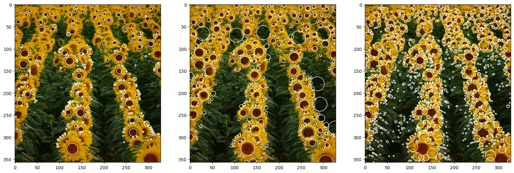
    


As a result, we have three output images: (1) - Normalized LoG, (2) - Non-Normalized Log, and (3) - Pre-built function. One difference is clear from the beginning, the algorithm of skimage has more granular results and the size of the detected blob is smaller than our algorithm. This initial difference is mainly due to the parameters of the algorithm. Secondly, it can be shown that the center of the sunflower is not detected but rather the petals are. This means that the skimage algorithm is using the same function as us \textbf{but} with a plus in front of it.
As per the two algorithms done from scratch, both result in a rather precise detection. As expected, the normalized algorithm produced fewer outliers, due to the stronger response in the case of successful matching, and better results as it is more precise in finding the center of the blob.
It has to be noted that the absence of smaller blobs in the first two images can be traced to two main factors: 1) higher threshold value and 2) different sigma range implementation in the algorithm

## Additional experiments to analyse the impact of threshold on resulting blob detection


```python
coordinates_diff_threshold = []

thresholds = [0.2,0.3,0.4,0.5,0.7,0.9]
thresholds = thresholds[::-1]

for x in thresholds:

    log_images_np, kernels, log_images_thresholded, sigma_list = log_image(img_gray, 8)        

    coordinates = detect_blob_v2(log_images_np, percentage_high=x)

    coordinates_1d = flatten_array_coordinates(coordinates)

    res = non_max_suppression(coordinates_1d)

    coordinates_diff_threshold.append(res)

titles = ["Threshold: " + str(x) for x in thresholds]
    
```

    before 5728
    after 2279
    before 2590
    after 921
    before 996
    after 395
    before 553
    after 256
    before 249
    after 145
    before 107
    after 68


```python
draw_circles_multi(img, coordinates_diff_threshold, titles=titles)
```


    
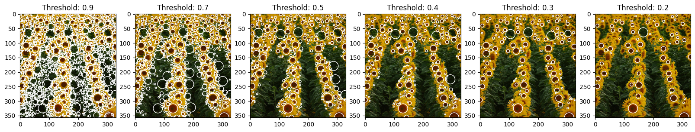
    


```python
threshold_values = [0.0, 0.02, 0.04, 0.06, 0.08]

thresholded_images = []
for index, value in enumerate(threshold_values):
    thresholded_images.append(non_max_suppression(normalized_log_gray(image_gray, sigma=1.1, threshold=value, conv_number=8)))

draw_circles_multi(image_rgb, thresholded_images)
```

    before 62593
    after 3517
    before 13748
    after 1266
    before 1449
    after 339
    before 97
    after 59
    before 12
    after 11


    
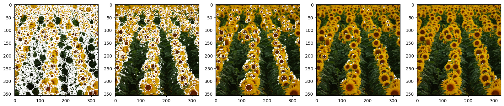
    


As we can see from the examples below, threshold values are very important for the output. For the analysis we decided to go with gradual increase of the threshold, starting with 0.0 and with the max value of 0.08. As it was expected, threshold value and number of blobs are inversely proportional - with the increase of threshold we observe decrease in a blob count.
For the 0.0 value we basically received white image (without non-max supression it would have been fully covered with white, having the number of detected pixels that "contribute" to blob) - this happened due to the fact that we pretty much don't threshold at all and let all maximum pixel intensities contribute to blobs (each pixel has a max within the 8-dimensional kernel, so all pixels will have to be activated). Here we can also see that with the given hyperparameters there are almost no pixels with intencities higher that 0.06 (last two examples), so to be able to tune the threshold to the "optimal value" in this set up we will have to search for the value between 0.02, although this is still very little value that produces too much noise, and 0.06 (with 0.04 being latest greatest pick).

## Other tests


```python
input_image_fish = cv2.imread("../images/fishes.jpg")
image_rgb_fish = cv2.cvtColor(input_image_fish, cv2.COLOR_BGR2RGB)
image_gray_fish = cv2.cvtColor(input_image_fish, cv2.COLOR_BGR2GRAY)

input_image_butterfly = cv2.imread("../images/butterfly.jpg")
image_rgb_butterfly = cv2.cvtColor(input_image_butterfly, cv2.COLOR_BGR2RGB)
image_gray_butterfly = cv2.cvtColor(input_image_butterfly, cv2.COLOR_BGR2GRAY)

f, (ax1, ax2) = plt.subplots(2, 2)
ax1[0].imshow(image_rgb_fish)
ax1[0].set_title("Original image of fish")
ax1[1].imshow(image_gray_fish, cmap='gray')
ax1[1].set_title("Original image of fish in grayscale")
ax2[0].imshow(image_rgb_butterfly)
ax2[0].set_title("Original image of butterfly")
ax2[1].imshow(image_gray_butterfly, cmap='gray')
ax2[1].set_title("Original image of butterfly in grayscale")
plt.tight_layout()
plt.show()
```


    
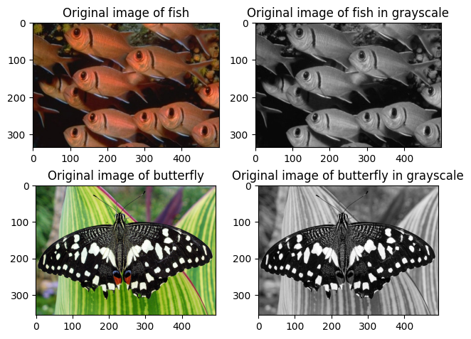
    


```python
fish_blobs = normalized_log_gray(image_gray_fish, sigma=1.15, threshold=0.03, conv_number=8, step_size=1.27)
fish_blobs = non_max_suppression(fish_blobs)

draw_circles(image_rgb_fish, fish_blobs)
```

    before 499
    after 57


    
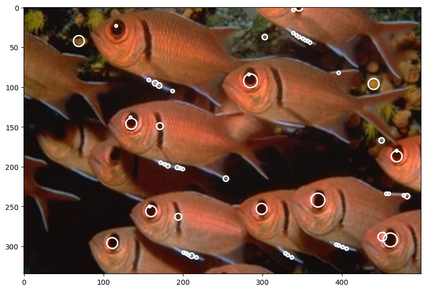
    


```python
butterfly_blobs = normalized_log_gray(image_gray_butterfly, sigma=1.2, threshold=0.09, conv_number=7)

draw_circles(image_rgb_butterfly, butterfly_blobs)

```


    
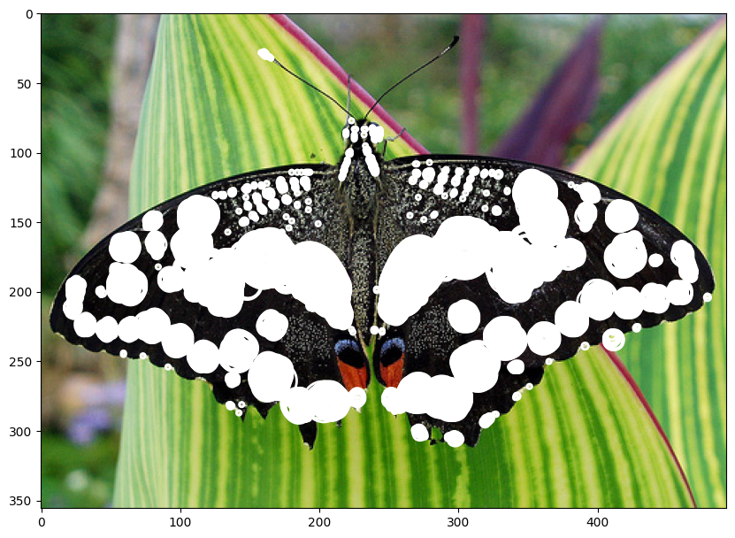
    


```python
coordinates_diff_images = []
images = []

import os

# read folders

for image in os.listdir("../images/"):          

    print(image)

    # Read image
    img = io.imread('../images/' + image)
    images.append(img)

    # Convert to grayscale
    img_gray = color.rgb2gray(img)

    log_images_np, kernels, log_images_thresholded, sigma_list = log_image(img_gray, 8)        

    coordinates = detect_blob_v2(log_images_np, percentage_high=0.4)

    coordinates_1d = flatten_array_coordinates(coordinates)

    res = non_max_suppression(coordinates_1d)

    coordinates_diff_images.append(res)
```

    fence.jpg
    before 3383
    after 1512
    fishes.jpg
    before 534
    after 223
    flowers.png
    before 553
    after 256
    einstein.jpg
    before 135
    after 49
    butterfly.jpg
    before 409
    after 194


```python
titles = [str(x) +  " - threshold 0.4" for x in os.listdir("../images/")]
draw_circles_multi_images(images, coordinates_diff_images, titles=titles)
```


    

    


As we can see during these additional tests, normalized LoG implemented from scratch does work on different images. Although, it worth mentioning afain that the key is in tuning the hyperparameters with regard to the input data.

