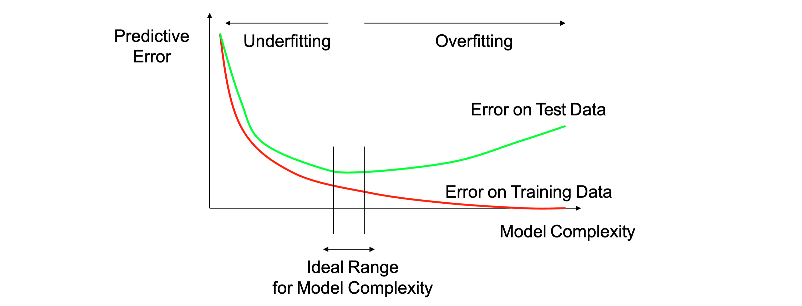

## Linear regression

Linear regression means give a set of data points, find the best line that fits the data.

### Hypothesis class:

**The hypothesis class is a set of functions (predictors) that can be chosen as the best hypothesis to describe our underlying relationship between inputs and outputs**

Key aspects:
- simplicity
- expressiveness
- computational efficiency
- generalization

weight vector w = [w1,w2]
feature extractor phi(x) = [1,x]

fw(x) = w * phi(x) **score**

hyphotesis class -> F = {$f_w$: w $\in$ $R^2$}

This is an example where the weights represents a line on the 2D coordinate system.

### Loss function

$$Loss(x,y,w) = (f_w(x) - y)^2$$

it tells how good a predictor is and basically the error that there is between your prediction AND the ground truth

TrainLoss is a related concept:

$$\frac{1}{|D_{train}|} \sum_{(x,y) \in D_{train}} Loss(x,y,w)$$

It is the average loss over the training set.

## Gradient descent

Goal -> minimize the Trainloss(W)

**Gradient:** the gradient $\nabla_w$ of Trainloss(W) is the direction that increases the training loss the most (the direction of the steepest ascent) Therefore we need to go in the opposite direction to minimize the loss.

We first have the figure for the trainLoss function:

For this function we only have 2 dimensions, but in reality we have more dimensions. The gradient will be the vector of partial derivatives.

We can use an example to understand this. Let's say we have the following function:

$$f(x,y) = x^2 + y^2$$

The gradient will be:

$$\nabla f(x,y) = [2x, 2y]$$

The gradient will be a vector that points in the direction of the steepest ascent. In this case, the gradient will be a vector that points to the origin.

- At point (1,1) the gradient will be [2,2] therefore a vector that points to [2,2]
- At point (0,0) the gradient will be [0,0] therefore a vector that points to [0,0] -> this implies that we are at a local minimum (indeed f(x,y) has its minimum at (0,0))

When we have the gradient we can update the weights W in the following way:

$$W \leftarrow W - \eta \nabla_w TrainLoss(W)$$

## Linear classification framweork

We have some datapoints and we need to assign them to one of two classes.

In this case we want a function that takes a datapoint and returns positive or negative based on the class.

The decision boundary will therefore be:

$x$ such that $w^T \phi(x) = 0$

Therefore the general binary classifier is:

$$f_w(x) = sign(w^T \phi(x))$$

And the hypothesis class is:

$$F = {f_w: w \in R^d}$$

### Loss function

The loss function in this case will check if the sign is the same as the ground truth. If it is the same, then the loss will be 0, otherwise it will be 1.

$$Loss(x,y,w) = \mathbb{1}[sign(w^T \phi(x)) \neq y]$$ 

N.B. that the one there means it is one only if the condition inside is true

### Score and margin

- score: how confident we are on predicting the correct class

$$score(x,y) = w^T \phi(x)$$

- margin: is how correct we actually are

$$margin(x,y) = (w^T \phi(x))y$$

Obvously it is impossible to calculate the gradient at any point, therefore we need another function to calculate the loss.

### Hinge loss

The gradient of the hinge loss is:

$$\nabla_w Loss(x,y,w) = \begin{cases} 0 & \text{if } margin(x,y) \geq 1 \\ -y\phi(x) & \text{otherwise} \end{cases}$$

This make sense because if we have that the margin of of a point is greater than one, we are confident that it is correctly classified. When the margin is less then one, we are less confident and therefore we want to make sure to modify our weights to get a bigger margin and therefore a bigger accuracy.
When the margin is less than 0, it means that the point has been misclassified and therefore we need to modify the weights accordingly to make it shift to the correct class.

## Logistic Loss and all the others

On the contrary the Logistic loss will always learn something even if we are in the correct class. It is not learning as fast because the steepness of the curve is not as high, and also it is a bit more computationally expensive.

In summary we have:

| | Regression | Classification |
| --- | --- | --- |
| Prediction $f_w(x) | score | sign(score) |
| Relate to target y | Residual (score - y) | Margin (score * y) |
| Loss | Squared loss, absolute | Hinge loss, zero-one, logistic |
| Algorithm | Gradient Descent | Gradient descent |

## Gradient descent

-> it is slow!
-> each iteration requires going over all training examples

### Stochastic gradient descent
-> it is a bit faster
-> the weights are updated after each example

### Mini-batch gradient descent
-> it is a mixture of the previous two, good balance
-> weights are updated every k examples

### Step size

The step size is the eta in the formula:

$$W \leftarrow W - \eta \nabla_w TrainLoss(W)$$

What should $\eta$ be?

- too small -> slow convergence, more stable, can get stuck in local minima
- too large -> overshooting, faster, unstable

#### Strategies

- fixed step size
- decreasing step size

### Overfitting:

best definition so far: overfitting happens when the model learns the data so well that it learns not only the underlyng patterns but also the noise and the fluctuations in the data.

Mnemoic way: O.V.E.R. 
- Obsessively
- Validating
- Every
- Random detail

#### Reasons
- too few training data
- noise in the data
- hypothesis space is too large
- the input space is high dimensional

#### Overfitting

## Evaluation

How do we evaluate the model?

-> we train it on some data, called the training data
-> we evaluate it on some other data, called the test data -> this dataset has **never been seen** by the model before

This image is very important in the context of learning the best parameters, or estimator.

- We have that the big yellow oval is the set of all the possible predictors
- The small blue oval is instead the set of all predictors that we have access given our hypothesis class (models or predictors that we can consider/use)

Inside the blue ovel happens the learning process, where we try to find the best predictor to fit our data.

- Of course there will be a best predictor in the blue oval, and we call it g, the best predictor in the hypothesis class.
- We also have $f^*$ which is the best predictor overall in the space of all possible predictors, we can not reach it.

What we want is to reach the closest point inside the blue oval to the best predictor overall.

#### Estimation error 
Is the difference between our current position and the best predictor in the hypothesis class.

#### Approximation error
Is the difference between the best predictor in the hypothesis class and the best predictor overall.

#### Tradeoff

-> Approximation error decreases -> Estimation error increases (harder to find the best predictor in a bigger hypothesis class)

## How can we control the hypothesis class size?

## 1 - dimensionality

- manually select features, most importants the ones with more variance and less correlation, in other words the ones that are more informative
- automatic feature selection (boosting - L1 regularization - L2 regularization)

## 2 - norm

Reduce the norm (size - length - some measure of the size) of the weights, this will make the hypothesis class smaller and therefore the approximation error will be smaller. In other words this means that the weights are going to be between -1 and 1.

- Regularized objective, add some penalty to the loss function -> shrink the weights towards zero by $\lambda$
- Early stopping, stop the training before the weights get too big

## 3 - regularization

Idea -> penalize for large values of theta
- incorporate penalty into the cost function
- works well when we have a lot of features, each that contributes a bit to predicting the label

### L2 regularization

#### Relationship between regularization and bias-variance

- -> increase bias, decrease variance
- -> smoother hypothesis, reducing the opportunities to overfit (like in a function with a lot of parameters)
- -> regularization is a way to control the complexity of the hypothesis class
- -> $\lambda$ has to be chosen specifically for the problem
- -> $\lambda$ can be chosen by cross-validation

### Overfitting affects predictions

Images courtesy from slides of Percy Liang Dorsa Sadigh Mirko Mazzoleni Ryan P. Adams