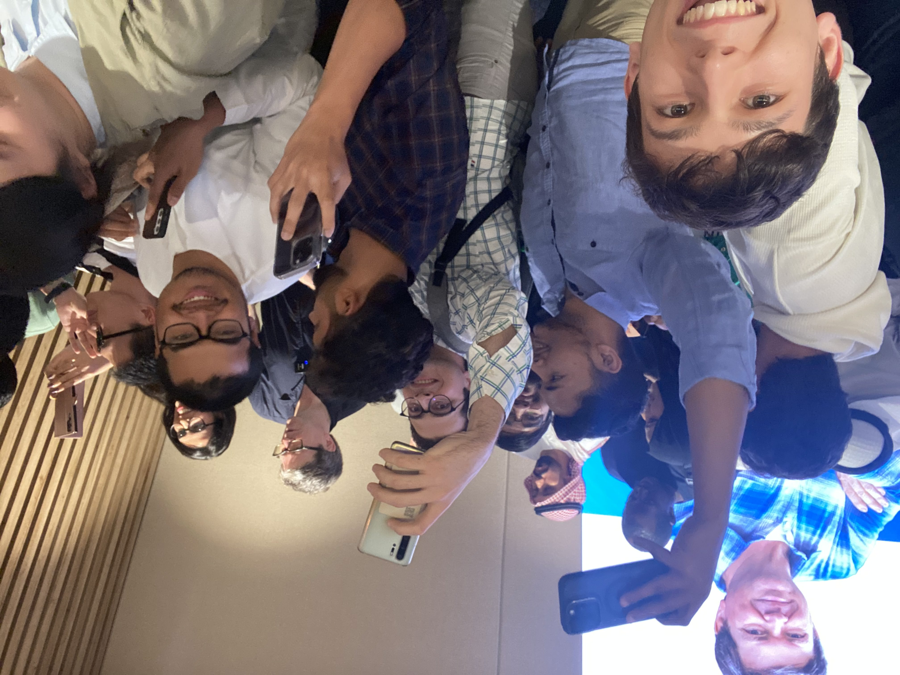
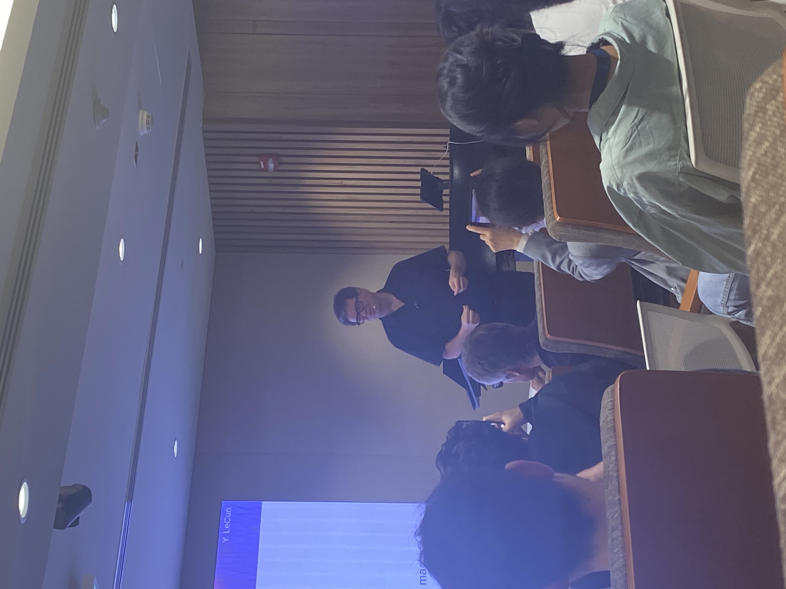
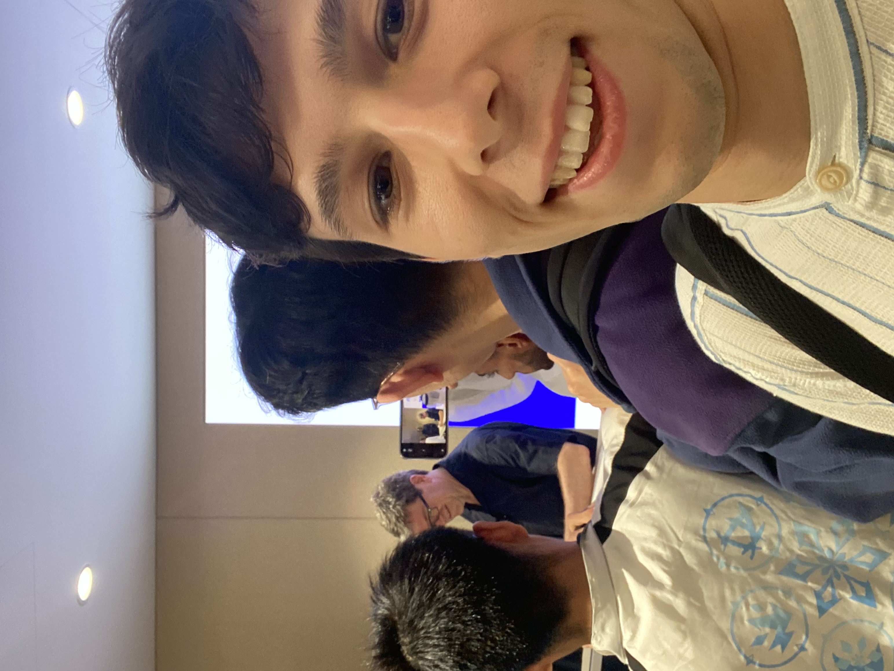

# A BIG day in AI

I woke up this morning and as usual the fatigue to go running was there. I did and runned my 6.5k in around 33 minutes, very good time and a bit unexpected. Days like this are a sign of a good day. Then while having breakfast with my favourite news platform namely x.com, I started seeing so many posts about Gemini 1.5. Then suddently a lot of video and tweets about some text-video model. I was confused. I was excited. OpenAI name was there, it must be something big I though. 

When I started watching the first video I was shocked. I thought this was lightyears away. And there I was with my cereal bowl and the best AI generated videos I have ever seen. I was very excited.
At the same time I was also doubtful: "What am I studying for then". Many things have been solved in AI already and this was a big step toward AGI, or as I would discover later to something else.

So, as much excited as doubtful as I was I went back to my desk and I started studying Gradient Descent and learning rates. It was the right thing to do, but still it was weird, that I feel I know so little yet so much has been done.

After the session I went to lunch with my dear friend Alvaro and Hassan. We discussed about random stuff and passports. 

I started reading about this new model and the more video I was watching the more stranged I was feeling. I saw some guy on the web doing already 3d reconstruction with such a videos. I am working on the same topic. I had to try so I did.

But in the meanwhile the higlight of the day and surely of the year, was that the GOAT Yann Le Cun was visiting the campus here today. When I found that out the previous day I was thrilled. I always looked up to him as an example and took so much ispiration from his talks and works.
It was a unique moment of deep knowledge, critical thinking and first principle reasoning. His insights were great and gave me hope on what I was thinking in the morning. Me and my generation have hope to still make an impact in the research field and hopefully as well for the society and the world.
The questions were not many as the time was limited, and only a handful stood out to me as knew and thought provoking.

1. My supervisor asked the quesiton (that many are wondering) if the accademia can still compete with the industry in terms of research. The answer wasn't quite clear, but the main point is that academia should challenge industry with new ideas and most importatly proposing new paradigms to solve the problems.
2. The second clever question worth noting is about what are the pillars that are most likely unchanging in the future of AI. The answer comprised 4 main points: backpropagation, the gradient, the minimization of an objective and the GPU. The first three are needed to the learning itself, the latest is the bottleneck of the learning process.

Another worth mentioning concept was about the way he mentioned that the Transformer can answer any question, but it will always answer questions using the same amount of computation. This is how it is trained, and what it is supposed to do. But we don't behave like this. If a quesiton is harder we spend more computational power/time in order to come up with the correct answer. I was enthusiastic about this concept and I feel it is worth exploring more.

This are some photos I was able to take with Yann Le Cun. The whole community was trying to get some photos and this is the best I could get.

I really hope to see him in the future as he is a great scientist and engineer as he called himself. 

All in all the day went pretty well, I was able to finish the 3D gaussian reconstuction I started earlier, which lead me to do a video and post it on youtube. I got also some comments from the video of the campus tour of the university and I was happy to see that people are interested in what we are doing here.

This is the result:



I might do a video about how I did it, and it is just simple softwares used one after the other. The peculiarity here is that the video was generated by an AI model, with emergent 3D capabilities. In other words the 3D informations were consistent throughout the video, and this is a big step toward the future of AI generated videos. 
This was also proved by the good even if not perfect results I got from the 3D reconstruction. 