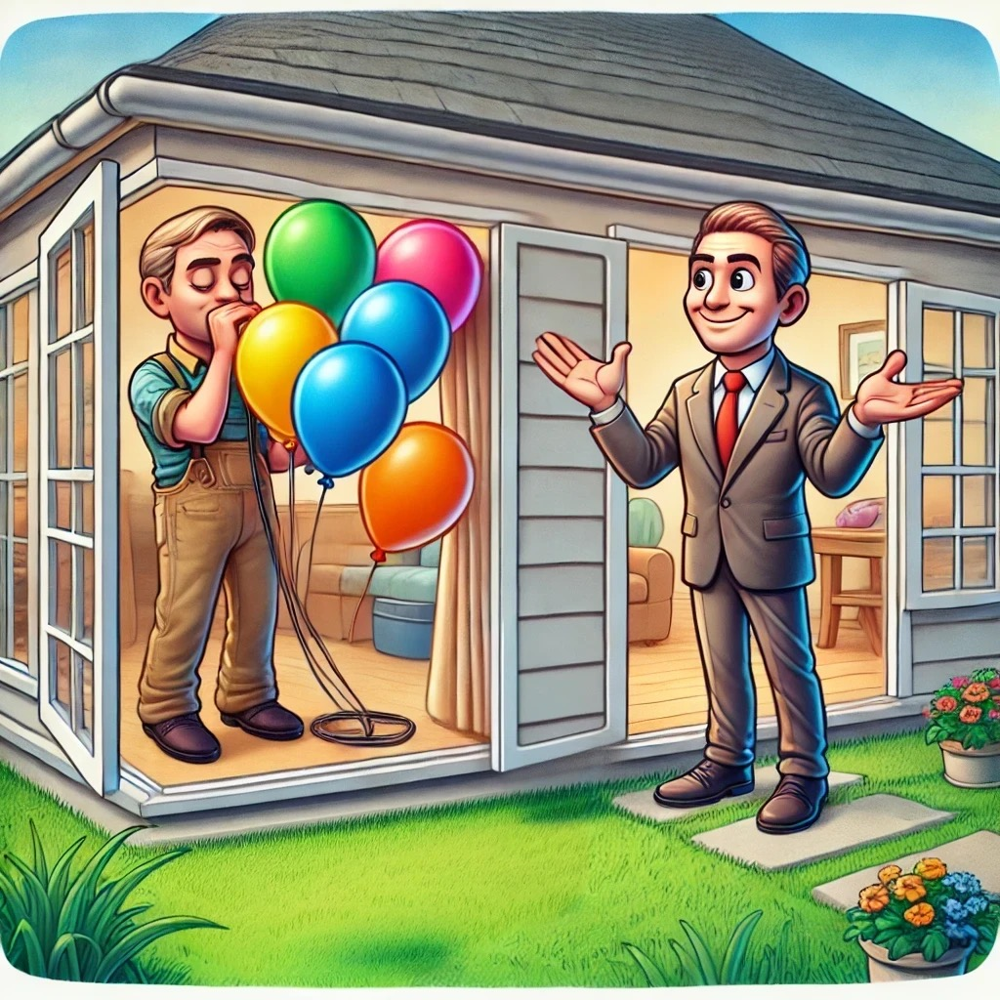
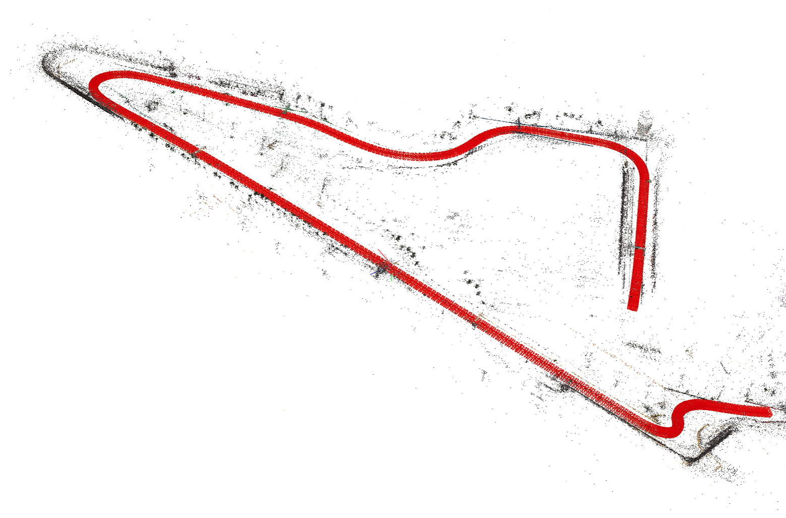

# Tinysplat

During my the journey to understand Gaussian Splatting, I created Tinysplat as a hands-on project to explore its foundational concepts. By breaking down the complex process into more manageable parts, I aimed to simplify and clarify the underlying mechanisms. In this post, I’ll share the insights and discoveries I’ve made along the way, shedding light on the essentials of Gaussian Splatting through the lens of my experience with Tinysplat.

## What is Gaussian Splatting?

Gaussian splatting is a novel explicit surface representation developed to represent the 3D structure of an object or an environment and then convert (rasterize) them into 2D images to be shown on our screens.

The 2 most important pieces of this concept are: Gaussian and Splatting.

### Gaussians

Gaussians is a shorthand for Gaussian distribution, which we are familiar from statistics in 1 dimension. Hold tight because in this process the dimensions of the Gaussian distribution will go up to 2 and 3. The most intuitive way to think of a Gaussian in 3 dimensions (with a lot of abuse in notation) is to think about it as a balloon. Of this balloon we can control different proprieties such as the rotation, the color, the size, by inflating it more or less etc.
Turns out that in the Gaussian Splatting process, we build the environment by merging together many of these balloons of different dimensions and colors at different positions in the space. Take a look at the following image:

You can think of a car being made of many balloons at different positions and different sizes and colors, but then you can observe this shape from many points and always understand that this is a car.
And this brings us to the second key concept: splatting.

### Splatting

Splatting is not a new concept and it refers to the technique of rendering each pixel on your monitor as the combination of many Gaussian-shaped "splats" (or balloons) by blending each contribution of each balloon given the camera position.
You might wonder what is special about this technique. Well in a single words it is DIFFERENTIABLE. It means that we can run back-propagation to whatever loss we have and therefore manipulating the properties of every balloons in our scene. To some degree we can think of differentiability as being a human inside the room that can listen to our commands shouting from a small window telling him where he should move every balloon to create an object. Without differentiability we would not have a way to communicate to the person inside.

Imagine there is no "open window" and no way for the two guys to communicate. Then the process will be NON differentiable. It is exactly the communication that was the key to enable many interesting applications of Gaussian splatting. Remember "Communication is key".

## But why?

Then you might ask why do we need to have a man inside a house inflating balloons and one guy outside observing and shouting?! Well that's a fair question.

In proper terminology what this techniques enable is to learn from just a handful of images, on the order of the hundreds, a whole object or environment, so hopefully we can generate "novel views". This fancy term refers basically that we can generate a rough 3D reconstruction from these images. 
Again in technical terms we are over-fitting a scene or also inferring from the images we have at our disposal, what would the image look like from a completely different point of view that we didn't have before. 

In conclusion this technique is called explicit neural radiance Field. The explicit term references the fact that the parameters of the Gaussians are stored as is, and in the weights as in the NeRF representation for example. Radiance field instead is just a fancy word that was chosen to describe the way that rays are captured by the camera coming from all the scene.

## Okay, balloons and communication, now what?

This is a legit question. How do we even generate these Gaussians, and even how do we position them? We don't have a human in the computer, let alone 2 people communicating!

The journey of creating a realistic scene is split into 2 parts:

1. Initialization of the priors
2. Fitting of the priors onto the images

### Priors initialization

Gaussian splatting works better if we have already a rough idea of what the scene looks like. Imagine having some rough sketch of what you want, it is going to be easier to realize your masterpiece. In the same way, Gaussian Splatting works best when our initial sketch is a Point Cloud. A point cloud is exactly a way to define a rough sketch of the scene.

The most common way to obtain is to run an algorithm called Structure from Motion. In other words given images of the scene from different positions it will triangulate the points and create a 3D representation which is close enough to reality. These methods are still improving and there is no best approach but it depends on many factors such as dimensions, motions etc. In the end this is still an open research question, therefore many more options (hopefully) are coming every month.

Here you can have a look of what that means. The red "things" (camera frustums), represent the rotation and position of the cameras in space, whilst the points (which should be colored), they represent the 3D space that was reconstructed. It is called "sparse" reconstruction because as you might have noticed, it is missing a lot of points, but the 3D high level idea can be interpreted by a human at least.

Once this rough initialization has been created is time to go to next step.

### Fitting of the Gaussians (more technical)

This part is the most mindblowing and difficult, so take a deep breath and let's dive into cold waters.

Now that we have some images, the position and rotation of the cameras, where the image was taken and the priors point cloud, the real training begins.

It works very similar as in neural networks, where we have a set of parameters that needs to optimized using some gradient descent algorithm such as SGD. In this case all gaussians are initialized with the color and point in 3D space provided by the SfM algorithm. The scale and rotations are initialized as standard values such as 1. 

During training we use these values to create and project the Gaussians onto the screen in a **differentiable manner**. This will produce some strange images at first, by projecting all the gaussians to the screen that is orientated and positioned in the same way as the way the image was taken. 

This way we have a reference of what the image should be at that position, and what we actually get from the "splatting" process. Now you might have understood already, we can calculate a **loss** or **difference** in similarity between the two images. There are 2 ways this difference is computed, and usually is a combination of different losses such as f1 loss, and SSIM loss, where $\lambda$ is a parameter used to balance the two accuracies.

$$
(1 - \lambda) * \text{F1-loss(img1, img2)} + \lambda * \text{SSIM(img1, img2)}
$$

In this way iterating over the many images in the dataset, batch by batch, we can optimize the parameters of the whole number of Gaussians by backpropagating the error back to each gaussian based on the (sum) of the error(s) from every pixel in each image.
By optimizing these parameters, after some epochs, a clear image can be seen. A 2D example is displayed below. What you see is a video of the training where the Gaussians gets progressively refined and the final result is a sharp and crisp image.



(*Video courtesy of* [OutOfAI](https://github.com/OutofAi/2D-Gaussian-Splatting))

### Final thoughts 

This is a good introductory article to Gaussian splatting in a non-technical way. If you would like to dig deeper into the topics I am compiling a series of blog post where I show the implementation of Gaussian Splatting in 2D [here](https://sebo-the-tramp.github.io/04_notebook/tinysplat/) and in the future also in 3D. 

I will leave another list of good material that helped me understand better the topic. Let me know if this was helpful, and especially how I can improve!