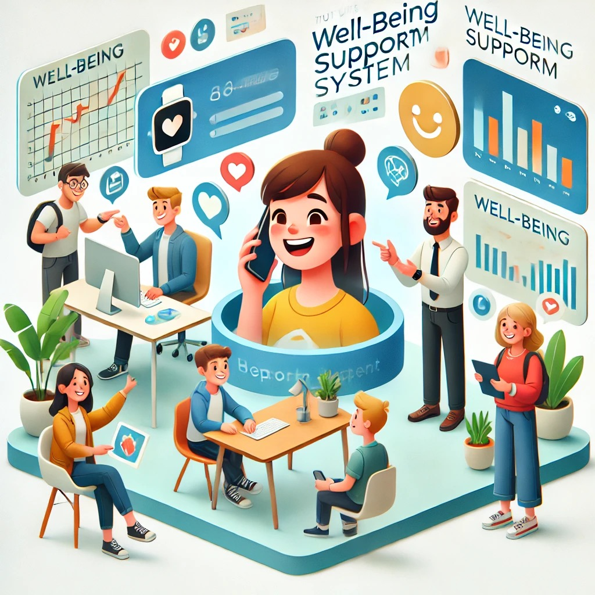

# Wellround


Transforming the chaos of personal data into personalized, holistic health insights—to empower you to achieve your full potential!


<!-- This is the motto of Wellround. This is our north star. And now if you wish to follow along, I will bring you to the beginning of our Journey, navigating towards the north star.

## Start with why.

Every adventure starts with a desire, a burning spirit of search. Curiosity and knowledge power the engine of our ever working mind, but sometimes the sources of energy come less and so does our motivation. Our grit is tested, and in these moments of doubt the world seems to be untractable and we fall. 

I am sure every single reader of this passage would have felt this, it is not only my feeling, but rather an alarming statistics. Sooner or later that might happen, and too often such minima of one's life, might be fatal. This is our main motivation for building. This moves progress in our code and plans. It started as a personal journey, that we felt on our skin. We were able to get back up and we learned to "tryfall". We have been lucky and we want to transform our luck into a actionable value for as many people as we can reach. This is why Wellround was founded.
We know that each one of us is unique and irreplaceable, precious. Because of this our philosophy is based on the assumption that everyone experiences and reacts to life in uncountable many different ways. It is quite impossible to cover every scenario and every possibility with traditional technology, but with the rise of smartwatches, IoT, and Large Language Models, the problem becomes very much more tractable.

## How?

This new technologies that are enabling this new AI revolution are the core of the solution we are proposing. By leveraging the chaos of data that everyone of us produce, we will give recommendations and actionable insights on what people can do. We will not only use data from a single source, but we are going to correlate datapoints from as many sources as possible. Even if now the sources seems not enough, the future is going to be exponential and the only limit we see is the sky. So stick with us and learn together with us what limitless really means.

## What?

This is the simplest of the three points. Again it will be like magic. You will not be bothered by settings here or useless notifications. No nothing like that, forget all your previous experiences. Wellround will become an extension of your body, a digital twin where you can reliably get advices, help and improve to achieve your full potential. So far we only talked about technology, but we know that ultimately we are social beings, and we want also to revert the trend of people going online to solve their problems. This is why we are creating communities on our application to support meetings and activities offline as much as possible. Because in the end "No *human* is an Island".

## Action, action, so what do I do?
If you read so far, you have done the first step to achieve your full potential, congratulations 🎉. If are already embarked in your journey, I wish you all the best, 
might you achieve it in the end. If you are curious to try out our roadmap and copilot for the journey, download our app, is FREE at [www.wellround.me](www.wellround.me) -->

## WHY?

I'll tell you a story of Sebastian an ambitious student. He got accepted into a highly competitive university program. His family and friends even his girlfriend Giulia (who wont be able to see him for a while) were so proud and supportive as he was ready to embark in this new transformative and enriching journey. 

Months passed, and the pressure kept building. He told himself he was ready, that he could handle it all. But the ambitious student, eager to prove himself, started taking on more and more—new projects, extra coursework, bigger goals. He wanted everything to be perfect.

But perfection never came. The scores weren’t what he hoped for, his peers seemed a step ahead, and strict professors scrutinised every small mistake. The harder he worked, the more things slipped out of control. Instead of slowing down, he doubled down. _This is my one shot,_ he thought.

But the cracks were showing. Friends stopped seeing him. His focus shattered, scattered in a hundred directions, yet nothing seemed to move forward. Giulia—his anchor, his cheerleader—tried to hold on, but he was slipping away. Anxious, angry, and burned out, he became someone she couldn’t recognise. One day, she left.

And that’s when Sebastian hit rock bottom. Burned out. Alone. His dreams felt meaningless. He stopped chasing all his dreams altogether.

But that wasn’t the end of the story.

Sebastian is me. And this was my wake-up call. I realized something profound: success isn’t just about what you achieve—it’s about how you get there and who’s with you when you do.

Hitting rock bottom made me ask a question: How can we chase our dreams without losing ourselves or the people who matter most?

## HOW?

That’s why we’re building Wellround.

Our system helps people manage their ambitions while protecting their mental and emotional well-being. Here’s how it works:

1. We gather data from smartwatches, calendars, screen time, and more to give you a complete picture of your well-being.
2. Using LLMs—advanced AI models—we analyze this data to identify patterns and predict risks like burnout or stress.
3. Our platform provides actionable insights: notifications when your stress is climbing, suggestions for better work-life balance, and prompts to take breaks before it’s too late.
4. With your consent, real psychologists and coaches can access this data in a meaningful, context-rich way, enabling personalized support tailored to your unique journey.

This is more than an app; it’s a system to help you thrive, combining cutting-edge technology with genuine human care.

## WHAT?

Imagine Anna, a young professional managing multiple projects. Her smartwatch detects elevated stress during her workday and sends her a notification:
“Hey, Anna, your stress levels are climbing. Take a 5-minute break to breathe.”

Anna opens the app and sees a clear summary generated by the AI:
“Your stress peaked at 3 PM due to back-to-back meetings. You’ve had no breaks today.”

It offers actionable tips:

- “Schedule focus blocks between meetings.”
- “Increase hydration—your activity levels suggest you’re dehydrated.”

Anna’s coach also receives a weekly summary, generated by the system, highlighting her progress and suggesting ways to adjust her workload for balance. Together, Anna and her coach plan a healthier approach to her goals.

This isn’t just data—it’s transformation.


**We are here to support you in chasing your dreams—without losing your Giulia.**


Check out more at [wellround.me](https://www.wellround.me)
